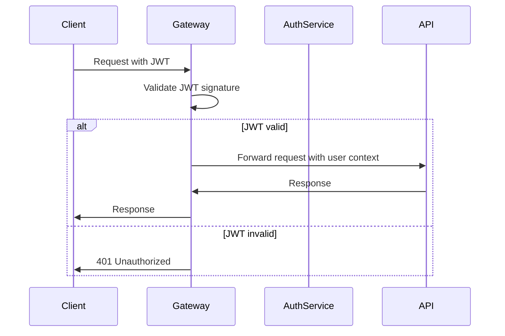

# Integration Architecture Documentation

*Service integration patterns, API gateway design, and inter-service communication strategies.*

## Overview

This section documents the integration architecture including API gateway implementation, service-to-service communication patterns, and external system integration strategies that enable seamless molecular analysis workflows.

## Integration Components

### **[API Gateway](gateway.md)**
Comprehensive API gateway architecture and implementation
- OpenResty/Nginx-based intelligent routing and load balancing
- JWT authentication and authorization middleware
- Rate limiting and request throttling policies
- Service discovery and health monitoring
- Request/response transformation and caching

## Integration Patterns

### API Gateway Architecture
```
┌─────────────────────────────────────┐
│          Client Applications        │ ← Web, Mobile, API clients
└─────────────────┬───────────────────┘
                  │ HTTPS/WSS
                  │ JWT Authentication
┌─────────────────▼───────────────────┐
│           API Gateway               │ ← OpenResty/Nginx
│  ┌─────────────────────────────────┐│
│  │    Authentication Middleware    ││ ← JWT validation
│  ├─────────────────────────────────┤│
│  │     Rate Limiting Layer         ││ ← Request throttling
│  ├─────────────────────────────────┤│
│  │    Service Discovery            ││ ← Dynamic routing
│  ├─────────────────────────────────┤│
│  │   Load Balancing & Routing      ││ ← Traffic distribution
│  └─────────────────────────────────┘│
└─────────────────┬───────────────────┘
                  │ Internal HTTP
                  │ Service Mesh
┌─────────────────▼───────────────────┐
│         Backend Services            │
│  ┌──────────┬──────────┬──────────┐ │
│  │ FastAPI  │  Worker  │ Storage  │ │ ← Microservices
│  │   API    │ Service  │ Service  │ │
│  └──────────┴──────────┴──────────┘ │
└─────────────────────────────────────┘
```

### Service Communication Patterns
```
┌─────────────────────────────────────┐
│        Synchronous (HTTP)           │ ← REST API calls
├─────────────────────────────────────┤
│       Asynchronous (Queue)          │ ← Celery task queues
├─────────────────────────────────────┤
│      Real-time (WebSocket)          │ ← Live status updates
├─────────────────────────────────────┤
│         Event-Driven               │ ← Domain events
└─────────────────────────────────────┘
```

### External Integration Points
```
┌─────────────────────────────────────┐
│     Molecular Databases             │ ← PDB, ChEMBL, UniProt
├─────────────────────────────────────┤
│    Computational Engines            │ ← Vina, Smina, Gnina
├─────────────────────────────────────┤
│      Cloud Storage                  │ ← AWS S3, MinIO
├─────────────────────────────────────┤
│    Authentication Providers         │ ← OIDC, LDAP, SAML
└─────────────────────────────────────┘
```

## Key Integration Features

### 🌐 **API Gateway Capabilities**
- **Intelligent Routing**: Dynamic service discovery and traffic routing
- **Security Enforcement**: Centralized authentication and authorization
- **Traffic Management**: Rate limiting, circuit breaking, and load balancing
- **Observability**: Request tracing, metrics collection, and logging
- **Protocol Translation**: HTTP/HTTPS to internal service protocols

### 🔄 **Service Mesh Integration**
- **Service Discovery**: Automatic service registration and discovery
- **Health Monitoring**: Continuous health checks and failover
- **Configuration Management**: Centralized configuration distribution
- **Security Policies**: mTLS and security policy enforcement
- **Traffic Splitting**: A/B testing and canary deployments

### 📡 **Real-time Communication**
- **WebSocket Gateway**: Real-time bidirectional communication
- **Server-Sent Events**: Live status updates and notifications
- **Message Broadcasting**: Multi-user collaboration features
- **Connection Management**: WebSocket connection pooling and scaling
- **Event Sourcing**: Domain event capture and replay

### 🔌 **External Integrations**
- **Database Connectors**: Direct molecular database integration
- **Engine Adapters**: Pluggable computational engine support
- **Storage Backends**: Multi-cloud storage abstraction
- **Authentication**: External identity provider integration
- **Monitoring**: APM and observability tool integration

## Implementation Guidelines

### API Gateway Configuration
```nginx
# OpenResty/Nginx configuration example
upstream api_backend {
    least_conn;
    server api:8000 max_fails=3 fail_timeout=30s;
    server api2:8000 max_fails=3 fail_timeout=30s;
    keepalive 32;
}

upstream worker_backend {
    server worker:8001 max_fails=2 fail_timeout=15s;
    keepalive 16;
}

server {
    listen 80;
    server_name api.molecular-dashboard.com;

    # JWT authentication
    access_by_lua_block {
        local jwt = require "resty.jwt"
        local auth_header = ngx.var.http_authorization

        if not auth_header then
            ngx.status = 401
            ngx.say("Missing Authorization header")
            ngx.exit(401)
        end

        # JWT validation logic
    }

    # Rate limiting
    limit_req_zone $binary_remote_addr zone=api_limit:10m rate=100r/m;

    location /api/v1/ {
        limit_req zone=api_limit burst=20 nodelay;
        proxy_pass http://api_backend;
        proxy_set_header Host $host;
        proxy_set_header X-Real-IP $remote_addr;
        proxy_set_header X-Forwarded-For $proxy_add_x_forwarded_for;
    }

    location /ws/ {
        proxy_pass http://api_backend;
        proxy_http_version 1.1;
        proxy_set_header Upgrade $http_upgrade;
        proxy_set_header Connection "upgrade";
    }
}
```

### Service Discovery Implementation
```python
# Python service discovery client
from typing import List, Optional
import consul
import random

class ServiceDiscovery:
    def __init__(self, consul_host: str = "consul", consul_port: int = 8500):
        self.consul = consul.Consul(host=consul_host, port=consul_port)

    def register_service(self, name: str, host: str, port: int, health_check_url: str):
        """Register service with Consul"""
        self.consul.agent.service.register(
            name=name,
            service_id=f"{name}-{host}-{port}",
            address=host,
            port=port,
            check=consul.Check.http(health_check_url, interval="10s")
        )

    def discover_service(self, service_name: str) -> Optional[str]:
        """Discover healthy service instances"""
        _, services = self.consul.health.service(service_name, passing=True)
        if services:
            service = random.choice(services)
            return f"http://{service['Service']['Address']}:{service['Service']['Port']}"
        return None
```

### WebSocket Integration
```typescript
// Frontend WebSocket client
class WebSocketClient {
  private ws: WebSocket | null = null;
  private reconnectAttempts = 0;
  private maxReconnectAttempts = 5;

  connect(token: string) {
    const wsUrl = `ws://localhost:8000/ws?token=${token}`;
    this.ws = new WebSocket(wsUrl);

    this.ws.onopen = () => {
      console.log('WebSocket connected');
      this.reconnectAttempts = 0;
    };

    this.ws.onmessage = (event) => {
      const data = JSON.parse(event.data);
      this.handleMessage(data);
    };

    this.ws.onclose = () => {
      this.handleReconnect();
    };

    this.ws.onerror = (error) => {
      console.error('WebSocket error:', error);
    };
  }

  private handleReconnect() {
    if (this.reconnectAttempts < this.maxReconnectAttempts) {
      setTimeout(() => {
        this.reconnectAttempts++;
        this.connect(this.getToken());
      }, Math.pow(2, this.reconnectAttempts) * 1000);
    }
  }

  private handleMessage(data: any) {
    switch (data.type) {
      case 'job_status':
        this.updateJobStatus(data.payload);
        break;
      case 'job_completed':
        this.handleJobCompletion(data.payload);
        break;
      default:
        console.warn('Unknown message type:', data.type);
    }
  }
}
```

## Security Integration

### Authentication Flow


### Authorization Patterns
```python
# Role-based access control middleware
from functools import wraps
from flask import request, jsonify

def require_role(required_role: str):
    def decorator(f):
        @wraps(f)
        def decorated(*args, **kwargs):
            user = get_current_user()
            if not user or user.role != required_role:
                return jsonify({'error': 'Insufficient permissions'}), 403
            return f(*args, **kwargs)
        return decorated
    return decorator

# Usage
@app.route('/admin/users')
@require_role('admin')
def list_users():
    return jsonify(get_all_users())
```

## Monitoring and Observability

### Distributed Tracing
```python
# OpenTelemetry integration
from opentelemetry import trace
from opentelemetry.instrumentation.fastapi import FastAPIInstrumentor

tracer = trace.get_tracer(__name__)

@app.post("/api/v1/jobs")
async def create_job(job_data: JobCreate):
    with tracer.start_as_current_span("create_job") as span:
        span.set_attribute("user.id", current_user.id)
        span.set_attribute("job.type", job_data.type)

        # Business logic
        result = await job_service.create(job_data)

        span.set_attribute("job.id", result.id)
        return result
```

### Metrics Collection
```python
# Prometheus metrics
from prometheus_client import Counter, Histogram, start_http_server

request_count = Counter('api_requests_total', 'Total API requests', ['method', 'endpoint'])
request_duration = Histogram('api_request_duration_seconds', 'API request duration')

@app.middleware("http")
async def metrics_middleware(request: Request, call_next):
    start_time = time.time()
    response = await call_next(request)

    request_count.labels(
        method=request.method,
        endpoint=request.url.path
    ).inc()

    request_duration.observe(time.time() - start_time)
    return response
```

## Related Documentation

- **[System Architecture](../system-design/README.md)** - Overall system design context
- **[API Documentation](../../api/README.md)** - API contract specifications
- **[Security Architecture](../../security/README.md)** - Security policies and implementation
- **[Deployment Configuration](../../deployment/README.md)** - Service deployment patterns
- **[Operations Runbook](../../operations/README.md)** - Integration troubleshooting

## Troubleshooting Integration Issues

### Common Problems
- **Service Discovery**: Check Consul health and service registration
- **Load Balancing**: Monitor upstream server health and traffic distribution
- **Authentication**: Verify JWT token validation and user context
- **Rate Limiting**: Check rate limit configurations and client behavior
- **WebSocket**: Monitor connection stability and message delivery

### Debug Commands
```bash
# Check API Gateway status
curl -f http://localhost/health

# Monitor service discovery
docker compose exec consul consul members

# Check service health
docker compose exec gateway nginx -t
docker compose logs gateway

# WebSocket debugging
wscat -c ws://localhost/ws?token=your_jwt_token
```
