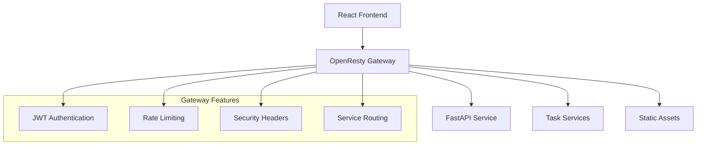
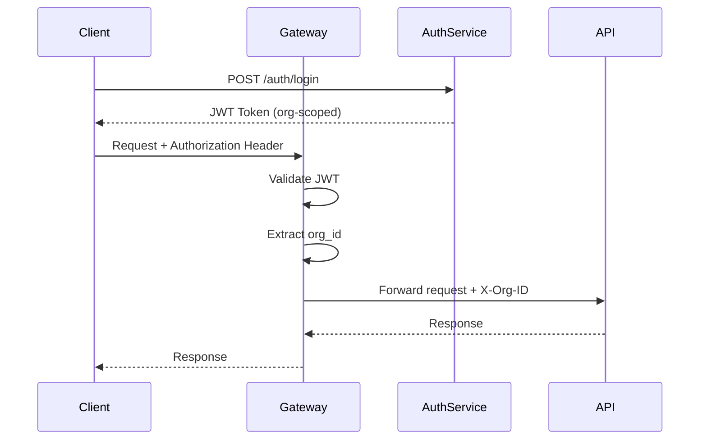

# API Gateway Architecture

This document describes the API Gateway implementation for the Molecular Analysis Dashboard, providing centralized routing, security, and service management.

## 🚪 **Gateway Overview**

The API Gateway serves as the single entry point for all client requests, implementing:
- **Centralized Authentication**: JWT validation and org-scoped authorization
- **Service Routing**: Dynamic routing to backend services
- **Rate Limiting**: Multi-tier protection (endpoint/user/organization)
- **Security Headers**: OWASP security headers and CORS handling
- **Load Balancing**: Intelligent routing and failover

## 🏗️ **Architecture Design**



## 🛠️ **Technology Stack**

### **OpenResty Gateway**
- **Nginx**: High-performance reverse proxy and load balancer
- **Lua Scripting**: Dynamic request processing and authentication
- **JWT Module**: Token validation and claims extraction
- **Rate Limiting**: Redis-backed rate limiting with multiple tiers

### **Key Components**
- **nginx.conf**: Core routing and proxy configuration
- **auth.lua**: JWT authentication and authorization logic
- **ratelimit.lua**: Multi-tier rate limiting implementation
- **utils.lua**: Shared utilities and helper functions

## 🔐 **Authentication & Authorization**

### **JWT Token Flow**


### **JWT Claims Structure**
```json
{
  "sub": "user_id",
  "org_id": "organization_id",
  "roles": ["admin", "researcher"],
  "exp": 1640995200,
  "iat": 1640908800
}
```

### **Authorization Logic**
```lua
-- auth.lua - JWT validation and org extraction
local jwt = require "resty.jwt"
local cjson = require "cjson"

function validate_jwt(token)
    local jwt_obj = jwt:verify(JWT_SECRET, token)

    if not jwt_obj.verified then
        return nil, "Invalid token"
    end

    local claims = jwt_obj.payload

    -- Validate required claims
    if not claims.org_id then
        return nil, "Missing org_id claim"
    end

    return claims, nil
end

function authorize_request()
    local auth_header = ngx.var.http_authorization

    if not auth_header then
        ngx.status = 401
        ngx.say(cjson.encode({error = "Missing authorization header"}))
        ngx.exit(401)
    end

    local token = string.match(auth_header, "Bearer%s+(.+)")
    if not token then
        ngx.status = 401
        ngx.say(cjson.encode({error = "Invalid authorization format"}))
        ngx.exit(401)
    end

    local claims, err = validate_jwt(token)
    if err then
        ngx.status = 401
        ngx.say(cjson.encode({error = err}))
        ngx.exit(401)
    end

    -- Set organization context for downstream services
    ngx.req.set_header("X-Org-ID", claims.org_id)
    ngx.req.set_header("X-User-ID", claims.sub)
end
```

## ⚡ **Rate Limiting Implementation**

### **Multi-Tier Rate Limiting**
1. **Endpoint Level**: Protect specific API endpoints
2. **User Level**: Prevent individual user abuse
3. **Organization Level**: Enforce org-wide quotas

### **Rate Limit Configuration**
```lua
-- Rate limit tiers (requests per minute)
local RATE_LIMITS = {
    endpoint = {
        ["/api/v1/jobs"] = 100,        -- Job creation
        ["/api/v1/upload"] = 50,       -- File uploads
        ["/api/v1/tasks"] = 200        -- Task management
    },
    user = 1000,                       -- Per user per minute
    organization = {
        free = 5000,                   -- Free tier org limit
        pro = 20000,                   -- Pro tier org limit
        enterprise = 100000            -- Enterprise limit
    }
}
```

### **Redis-Backed Implementation**
```lua
-- ratelimit.lua - Redis-backed rate limiting
local redis = require "resty.redis"
local cjson = require "cjson"

function check_rate_limit(key, limit, window)
    local red = redis:new()
    red:set_timeout(1000)

    local ok, err = red:connect(REDIS_HOST, REDIS_PORT)
    if not ok then
        ngx.log(ngx.ERR, "Failed to connect to Redis: ", err)
        return true  -- Fail open
    end

    local current = red:incr(key)
    if current == 1 then
        red:expire(key, window)
    end

    red:set_keepalive(10000, 100)

    return current <= limit
end

function apply_rate_limits(org_id, user_id, endpoint)
    local current_time = ngx.time()
    local window = 60  -- 1 minute window

    -- Check endpoint-specific rate limit
    local endpoint_limit = RATE_LIMITS.endpoint[endpoint]
    if endpoint_limit then
        local endpoint_key = string.format("rate_limit:endpoint:%s:%d",
                                          endpoint, math.floor(current_time / window))
        if not check_rate_limit(endpoint_key, endpoint_limit, window) then
            return false, "Endpoint rate limit exceeded"
        end
    end

    -- Check user rate limit
    local user_key = string.format("rate_limit:user:%s:%d",
                                  user_id, math.floor(current_time / window))
    if not check_rate_limit(user_key, RATE_LIMITS.user, window) then
        return false, "User rate limit exceeded"
    end

    -- Check organization rate limit
    local org_tier = get_org_tier(org_id)  -- Lookup from database/cache
    local org_limit = RATE_LIMITS.organization[org_tier] or RATE_LIMITS.organization.free
    local org_key = string.format("rate_limit:org:%s:%d",
                                 org_id, math.floor(current_time / window))
    if not check_rate_limit(org_key, org_limit, window) then
        return false, "Organization rate limit exceeded"
    end

    return true, nil
end
```

## 🛣️ **Service Routing Configuration**

### **Nginx Configuration**
```nginx
# nginx.conf - Service routing configuration
server {
    listen 80;
    server_name localhost;

    # Security headers
    add_header X-Frame-Options "DENY" always;
    add_header X-Content-Type-Options "nosniff" always;
    add_header X-XSS-Protection "1; mode=block" always;
    add_header Referrer-Policy "strict-origin-when-cross-origin" always;
    add_header Content-Security-Policy "default-src 'self'" always;

    # Request ID for tracing
    set $request_id $request_id;
    add_header X-Request-ID $request_id always;

    # CORS handling
    location ~ ^/api/ {
        if ($request_method = 'OPTIONS') {
            add_header Access-Control-Allow-Origin '*';
            add_header Access-Control-Allow-Methods 'GET, POST, PUT, DELETE, OPTIONS';
            add_header Access-Control-Allow-Headers 'Authorization, Content-Type, X-Request-ID';
            add_header Access-Control-Max-Age 3600;
            add_header Content-Length 0;
            add_header Content-Type text/plain;
            return 204;
        }

        # Authentication and rate limiting
        access_by_lua_block {
            require("auth").authorize_request()
            require("ratelimit").apply_rate_limits(
                ngx.req.get_headers()["X-Org-ID"],
                ngx.req.get_headers()["X-User-ID"],
                ngx.var.uri
            )
        }

        # Proxy to FastAPI service
        proxy_pass http://api:8000;
        proxy_set_header Host $host;
        proxy_set_header X-Real-IP $remote_addr;
        proxy_set_header X-Forwarded-For $proxy_add_x_forwarded_for;
        proxy_set_header X-Forwarded-Proto $scheme;
        proxy_set_header X-Request-ID $request_id;
    }

    # Task service routing
    location ~ ^/tasks/([^/]+)/(.*)$ {
        set $task_service $1;
        set $task_path $2;

        # Authentication required for task services
        access_by_lua_block {
            require("auth").authorize_request()
        }

        # Dynamic service discovery and routing
        proxy_pass http://task-$task_service:8080/$task_path$is_args$args;
        proxy_set_header X-Org-ID $http_x_org_id;
        proxy_set_header X-User-ID $http_x_user_id;
    }

    # Health checks (no auth required)
    location /health {
        proxy_pass http://api:8000/health;
    }

    location /ready {
        proxy_pass http://api:8000/ready;
    }

    # Static assets
    location / {
        proxy_pass http://frontend:3000;
        proxy_set_header Host $host;
        proxy_set_header X-Real-IP $remote_addr;
        proxy_set_header X-Forwarded-For $proxy_add_x_forwarded_for;
    }
}
```

## 📊 **Load Balancing & Service Discovery**

### **Upstream Configuration**
```nginx
# Dynamic upstream configuration
upstream api {
    least_conn;
    server api:8000 max_fails=3 fail_timeout=30s;
    keepalive 32;
}

# Task service discovery
upstream task_docking {
    least_conn;
    server task-docking-1:8080 max_fails=2 fail_timeout=15s;
    server task-docking-2:8080 max_fails=2 fail_timeout=15s;
    keepalive 16;
}
```

### **Health Check Integration**
```lua
-- Service health monitoring
function check_service_health(service_name)
    local httpc = require("resty.http").new()

    local res, err = httpc:request_uri(
        string.format("http://%s:8080/health", service_name),
        {
            method = "GET",
            timeout = 5000,
        }
    )

    return res and res.status == 200
end
```

## 🔍 **Observability & Monitoring**

### **Request Logging**
```nginx
# Custom log format for API Gateway
log_format gateway_log escape=json
    '{'
        '"timestamp":"$time_iso8601",'
        '"request_id":"$request_id",'
        '"method":"$request_method",'
        '"uri":"$request_uri",'
        '"status":$status,'
        '"response_time":$request_time,'
        '"user_id":"$http_x_user_id",'
        '"org_id":"$http_x_org_id",'
        '"user_agent":"$http_user_agent",'
        '"remote_addr":"$remote_addr"'
    '}';

access_log /var/log/nginx/gateway.log gateway_log;
```

### **Metrics Collection**
```lua
-- Prometheus metrics integration
local prometheus = require("prometheus")

-- Define metrics
local request_counter = prometheus.counter(
    "gateway_requests_total", "Total requests through gateway",
    {"method", "endpoint", "status"}
)

local request_duration = prometheus.histogram(
    "gateway_request_duration_seconds", "Request duration",
    {"method", "endpoint"}
)

-- Record metrics
function record_request_metrics(method, endpoint, status, duration)
    request_counter:inc(1, {method, endpoint, tostring(status)})
    request_duration:observe(duration, {method, endpoint})
end
```

## 🚀 **Gateway Deployment**

### **Docker Configuration**
```dockerfile
# Dockerfile.gateway
FROM openresty/openresty:alpine

# Install additional modules
RUN luarocks install lua-resty-jwt
RUN luarocks install lua-resty-redis

# Copy configuration files
COPY nginx.conf /usr/local/openresty/nginx/conf/nginx.conf
COPY lua/ /usr/local/openresty/nginx/lua/

# Health check
HEALTHCHECK --interval=30s --timeout=10s --start-period=5s --retries=3 \
    CMD curl -f http://localhost/health || exit 1

EXPOSE 80
CMD ["openresty", "-g", "daemon off;"]
```

### **Docker Compose Integration**
```yaml
# Gateway service in docker-compose.yml
services:
  gateway:
    build:
      context: .
      dockerfile: docker/Dockerfile.gateway
    ports:
      - "80:80"
    environment:
      - JWT_SECRET=${JWT_SECRET}
      - REDIS_HOST=redis
      - REDIS_PORT=6379
    depends_on:
      - api
      - redis
    networks:
      - app-network
```

## ⚙️ **Configuration Management**

### **Environment Variables**
```bash
# Gateway configuration
JWT_SECRET=your-jwt-secret-key
REDIS_HOST=redis
REDIS_PORT=6379

# Service endpoints
API_SERVICE_URL=http://api:8000
FRONTEND_SERVICE_URL=http://frontend:3000

# Rate limiting
DEFAULT_RATE_LIMIT=1000
ENTERPRISE_RATE_LIMIT=10000

# Security
ALLOWED_ORIGINS=https://yourdomain.com,http://localhost:3000
CORS_MAX_AGE=3600
```

### **Dynamic Configuration Updates**
```lua
-- Configuration reload without restart
function reload_config()
    local config_file = "/etc/nginx/gateway-config.json"
    local file = io.open(config_file, "r")

    if file then
        local content = file:read("*all")
        file:close()

        local config = cjson.decode(content)
        update_rate_limits(config.rate_limits)
        update_routing_rules(config.routing)
    end
end
```

## 🔧 **Gateway Management**

### **Administrative Endpoints**
```nginx
# Admin endpoints (internal only)
location /admin {
    allow 127.0.0.1;
    deny all;

    location /admin/config/reload {
        content_by_lua_block {
            require("admin").reload_config()
            ngx.say("Configuration reloaded")
        }
    }

    location /admin/stats {
        content_by_lua_block {
            local stats = require("admin").get_stats()
            ngx.say(cjson.encode(stats))
        }
    }
}
```

### **Circuit Breaker Implementation**
```lua
-- Circuit breaker for service protection
local circuit_breaker = {
    failure_threshold = 5,
    timeout = 60,
    states = {}  -- Per service state tracking
}

function circuit_breaker:call_service(service_name, func)
    local state = self.states[service_name] or {failures = 0, last_failure = 0}

    -- Check if circuit is open
    if state.failures >= self.failure_threshold then
        local time_since_failure = ngx.time() - state.last_failure
        if time_since_failure < self.timeout then
            return nil, "Circuit breaker open"
        end
    end

    -- Attempt service call
    local result, err = func()

    if err then
        state.failures = state.failures + 1
        state.last_failure = ngx.time()
    else
        state.failures = 0  -- Reset on success
    end

    self.states[service_name] = state
    return result, err
end
```

For related documentation:
- [System Architecture Overview](../system-design/overview.md)
- [Security Architecture](../../security/README.md)
- [Deployment Guide](../../deployment/README.md)
