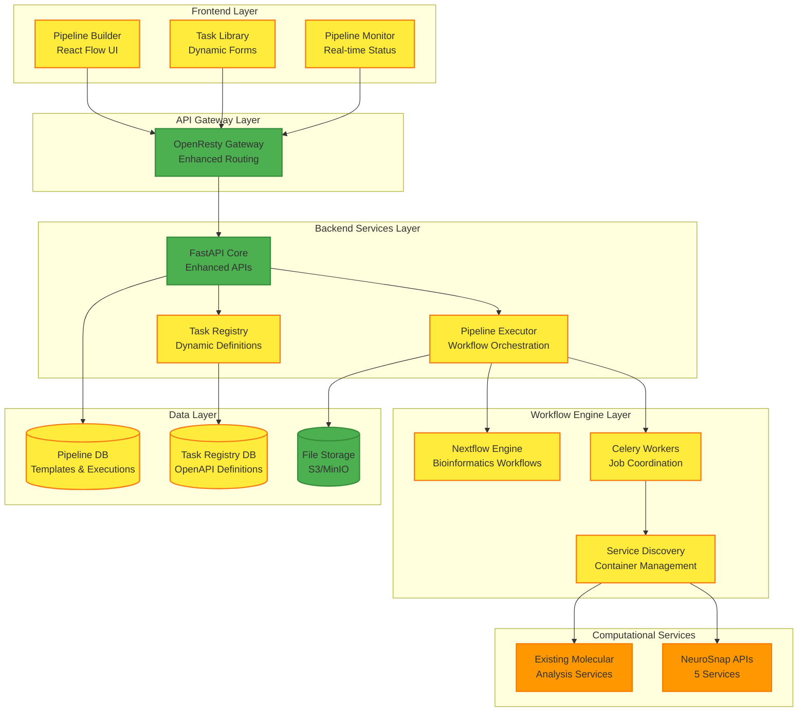
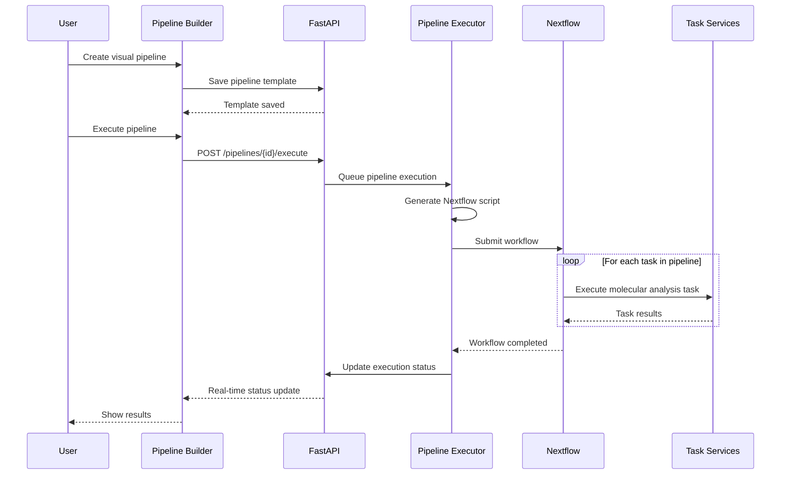

# Pipeline Builder System Design Specification

**Document Version**: 1.0  
**Last Updated**: November 9, 2025  
**Status**: Planning Phase  
**Priority**: Critical - Next Major Implementation Phase

---

## 📋 **Executive Summary**

The Pipeline Builder System represents the next critical phase in the Molecular Analysis Dashboard evolution, bridging our current **95% complete single-task platform** to the target **visual workflow orchestration system**. This system will enable users to create, execute, and manage complex multi-step molecular analysis workflows through an intuitive drag-and-drop interface.

### **Current Platform Status**
- ✅ **5 Molecular Analysis Services** operational (Structure Folding, Dynamics, Docking, Task Framework, Unified Management)
- ✅ **17+ REST API endpoints** with comprehensive SwaggerUI documentation
- ✅ **NeuroSnap Cloud Integration** with real-time job monitoring and result retrieval
- ✅ **Clean Architecture Foundation** ready for pipeline orchestration layer

### **Pipeline Builder Goals**
- **Visual Workflow Creation**: React Flow drag-drop interface for connecting analysis tasks
- **Multi-step Orchestration**: Execute dependent molecular analysis workflows  
- **Dynamic Task Registry**: Add new computational tasks without frontend deployment
- **Multi-tenant Pipeline Storage**: Org-isolated workflow templates and executions
- **Template Marketplace**: Reusable workflow patterns for common molecular analysis

---

## 🏗️ **System Architecture**

### **High-Level Architecture**


### **Core Components**

#### **1. Pipeline Builder Frontend (New)**
- **Technology**: React Flow + TypeScript
- **Purpose**: Visual workflow creation and editing
- **Features**:
  - Drag-drop task nodes with parameter configuration
  - Connection validation and dependency checking  
  - Real-time pipeline preview and validation
  - Template saving and sharing capabilities

#### **2. Pipeline Executor (New)**
- **Technology**: Python + Nextflow + Celery
- **Purpose**: Workflow orchestration and execution
- **Features**:
  - Nextflow script generation from visual pipelines
  - Multi-tenant execution isolation
  - Dependency resolution and task coordination
  - Progress monitoring and error handling

#### **3. Enhanced Task Registry (New)**
- **Technology**: PostgreSQL + OpenAPI 3.0
- **Purpose**: Dynamic task definition storage
- **Features**:
  - OpenAPI specifications stored in database
  - Runtime task registration without deployment
  - Service discovery integration
  - Form generation metadata

#### **4. Enhanced API Layer (Extended)**
- **Technology**: FastAPI (extend existing)
- **Purpose**: Pipeline management and execution APIs
- **Features**:
  - Pipeline CRUD operations
  - Execution management and monitoring
  - Task registry management
  - WebSocket real-time updates

---

## 📊 **Database Design**

### **Pipeline Templates Table**
```sql
CREATE TABLE pipeline_templates (
    template_id UUID PRIMARY KEY DEFAULT gen_random_uuid(),
    org_id UUID NOT NULL REFERENCES organizations(org_id),
    name VARCHAR(255) NOT NULL,
    description TEXT,
    category VARCHAR(100) NOT NULL DEFAULT 'Custom',
    
    -- Workflow Definition
    workflow_definition JSONB NOT NULL, -- React Flow + Nextflow metadata
    input_schema JSONB NOT NULL,        -- Expected input parameters
    output_schema JSONB NOT NULL,       -- Expected output format
    
    -- Template Metadata
    tags VARCHAR(255)[] DEFAULT '{}',
    is_public BOOLEAN DEFAULT FALSE,
    is_active BOOLEAN DEFAULT TRUE,
    version VARCHAR(50) NOT NULL DEFAULT '1.0.0',
    
    -- Audit Fields
    created_at TIMESTAMP DEFAULT NOW(),
    updated_at TIMESTAMP DEFAULT NOW(),
    created_by UUID REFERENCES users(user_id),
    
    CONSTRAINT unique_template_version UNIQUE(org_id, name, version)
);

CREATE INDEX idx_pipeline_templates_org ON pipeline_templates(org_id);
CREATE INDEX idx_pipeline_templates_public ON pipeline_templates(is_public, is_active);
CREATE INDEX idx_pipeline_templates_category ON pipeline_templates(category);
```

### **Pipeline Executions Table**
```sql
CREATE TABLE pipeline_executions (
    execution_id UUID PRIMARY KEY DEFAULT gen_random_uuid(),
    template_id UUID NOT NULL REFERENCES pipeline_templates(template_id),
    org_id UUID NOT NULL REFERENCES organizations(org_id),
    user_id UUID NOT NULL REFERENCES users(user_id),
    
    -- Execution State
    status VARCHAR(50) NOT NULL DEFAULT 'pending',
    priority INTEGER DEFAULT 0,
    
    -- Input/Output Data  
    input_parameters JSONB NOT NULL,
    execution_metadata JSONB DEFAULT '{}',
    results_uri VARCHAR(500),
    error_message TEXT,
    
    -- Timing
    submitted_at TIMESTAMP DEFAULT NOW(),
    started_at TIMESTAMP,
    completed_at TIMESTAMP,
    estimated_completion TIMESTAMP,
    
    -- Nextflow Integration
    nextflow_run_id VARCHAR(255),
    workflow_script_uri VARCHAR(500),
    
    CONSTRAINT valid_execution_status CHECK (
        status IN ('pending', 'queued', 'running', 'completed', 'failed', 'cancelled')
    )
);

CREATE INDEX idx_pipeline_executions_org ON pipeline_executions(org_id);
CREATE INDEX idx_pipeline_executions_user ON pipeline_executions(user_id);
CREATE INDEX idx_pipeline_executions_status ON pipeline_executions(status);
CREATE INDEX idx_pipeline_executions_template ON pipeline_executions(template_id);
```

### **Enhanced Task Registry Table**
```sql
-- Extend existing task registry with OpenAPI support
ALTER TABLE task_definitions ADD COLUMN IF NOT EXISTS openapi_spec JSONB;
ALTER TABLE task_definitions ADD COLUMN IF NOT EXISTS service_endpoint VARCHAR(500);
ALTER TABLE task_definitions ADD COLUMN IF NOT EXISTS health_check_endpoint VARCHAR(500);
ALTER TABLE task_definitions ADD COLUMN IF NOT EXISTS docker_image VARCHAR(500);
ALTER TABLE task_definitions ADD COLUMN IF NOT EXISTS resource_requirements JSONB DEFAULT '{}';

-- Add indexes for pipeline builder queries
CREATE INDEX idx_task_definitions_openapi ON task_definitions USING GIN(openapi_spec);
CREATE INDEX idx_task_definitions_category ON task_definitions(category);
CREATE INDEX idx_task_definitions_active ON task_definitions(is_active, org_id);
```

---

## 🔄 **Workflow Orchestration Design**

### **Nextflow Integration Strategy**

#### **1. Pipeline Script Generation**
```python
class NextflowScriptGenerator:
    """Generate Nextflow scripts from visual pipeline definitions"""
    
    def generate_workflow(self, pipeline_template: PipelineTemplate) -> str:
        """Convert React Flow definition to Nextflow DSL"""
        return f"""
        #!/usr/bin/env nextflow
        nextflow.enable.dsl=2
        
        // Generated from Pipeline Template: {pipeline_template.name}
        // Organization: {pipeline_template.org_id}
        // Version: {pipeline_template.version}
        
        {self._generate_processes(pipeline_template.workflow_definition)}
        
        workflow {{
            {self._generate_workflow_logic(pipeline_template.workflow_definition)}
        }}
        """
    
    def _generate_processes(self, workflow_def: Dict) -> str:
        """Generate Nextflow processes from task nodes"""
        
    def _generate_workflow_logic(self, workflow_def: Dict) -> str:
        """Generate workflow orchestration logic"""
```

#### **2. Task Service Integration**
```python
class TaskServiceAdapter:
    """Adapter for executing molecular analysis tasks in Nextflow"""
    
    async def execute_task(self, task_def: TaskDefinition, parameters: Dict) -> TaskResult:
        """Execute task via HTTP API or container"""
        if task_def.service_endpoint:
            return await self._execute_http_task(task_def, parameters)
        elif task_def.docker_image:
            return await self._execute_container_task(task_def, parameters)
        else:
            raise ValueError(f"No execution method for task {task_def.task_id}")
    
    async def _execute_http_task(self, task_def: TaskDefinition, parameters: Dict):
        """Execute via existing NeuroSnap/HTTP APIs"""
        
    async def _execute_container_task(self, task_def: TaskDefinition, parameters: Dict):
        """Execute via containerized task service"""
```

### **Pipeline Execution Flow**


---

## 💻 **Frontend Architecture**

### **React Flow Pipeline Builder**

#### **Core Components**
```typescript
// Pipeline Builder Main Component
interface PipelineBuilderProps {
  templateId?: string;
  mode: 'create' | 'edit' | 'view';
}

function PipelineBuilder({ templateId, mode }: PipelineBuilderProps) {
  const [nodes, setNodes] = useState<Node[]>([]);
  const [edges, setEdges] = useState<Edge[]>([]);
  const [availableTasks] = useTaskLibrary();
  
  return (
    <ReactFlow
      nodes={nodes}
      edges={edges}
      onNodesChange={onNodesChange}
      onEdgesChange={onEdgesChange}
      onConnect={onConnect}
      nodeTypes={nodeTypes}
      edgeTypes={edgeTypes}
    >
      <TaskPalette tasks={availableTasks} />
      <PipelineControls />
      <MiniMap />
      <Controls />
    </ReactFlow>
  );
}

// Task Node Component
interface TaskNodeData {
  taskDefinition: TaskDefinition;
  parameters: Record<string, any>;
  validation: ValidationResult;
}

function TaskNode({ data }: { data: TaskNodeData }) {
  return (
    <div className="task-node">
      <div className="task-header">
        <TaskIcon type={data.taskDefinition.category} />
        <span>{data.taskDefinition.name}</span>
      </div>
      
      <div className="task-ports">
        {data.taskDefinition.inputs.map(input => (
          <Handle key={input.name} type="target" position={Position.Left} id={input.name} />
        ))}
        {data.taskDefinition.outputs.map(output => (
          <Handle key={output.name} type="source" position={Position.Right} id={output.name} />
        ))}
      </div>
      
      <div className="task-status">
        <ValidationIndicator result={data.validation} />
      </div>
    </div>
  );
}
```

#### **Dynamic Form Generation**
```typescript
// Auto-generate forms from OpenAPI specs
interface DynamicFormProps {
  taskDefinition: TaskDefinition;
  values: Record<string, any>;
  onChange: (values: Record<string, any>) => void;
}

function DynamicForm({ taskDefinition, values, onChange }: DynamicFormProps) {
  const schema = useMemo(() => 
    generateFormSchema(taskDefinition.openapi_spec), [taskDefinition]
  );
  
  return (
    <Form
      schema={schema}
      values={values}
      onChange={onChange}
      validation={validateParameters}
    />
  );
}

function generateFormSchema(openApiSpec: OpenAPISpec): FormSchema {
  // Convert OpenAPI parameters to form field definitions
  const parameters = openApiSpec.paths['/execute'].post.parameters;
  
  return parameters.reduce((schema, param) => {
    schema[param.name] = {
      type: param.schema.type,
      title: param.description || param.name,
      required: param.required || false,
      validation: generateValidationRules(param.schema)
    };
    return schema;
  }, {});
}
```

### **Real-time Monitoring Dashboard**
```typescript
// Pipeline Execution Monitor
interface PipelineMonitorProps {
  executionId: string;
}

function PipelineMonitor({ executionId }: PipelineMonitorProps) {
  const { execution, isLoading } = usePipelineExecution(executionId);
  const { taskStatuses } = useWebSocket(`/ws/executions/${executionId}`);
  
  return (
    <div className="pipeline-monitor">
      <ExecutionOverview execution={execution} />
      
      <div className="task-progress">
        {execution.workflow_definition.tasks.map(task => (
          <TaskProgressCard 
            key={task.id}
            task={task}
            status={taskStatuses[task.id]}
          />
        ))}
      </div>
      
      <ExecutionLogs executionId={executionId} />
    </div>
  );
}
```

---

## 🔌 **API Design**

### **Pipeline Management Endpoints**

```python
# Pipeline Template Management
@router.post("/pipelines/templates", response_model=PipelineTemplateResponse)
async def create_pipeline_template(
    request: CreatePipelineTemplateRequest,
    org_id: str = Depends(get_current_organization),
    user_id: str = Depends(get_current_user)
) -> PipelineTemplateResponse:
    """Create new pipeline template from visual workflow"""

@router.get("/pipelines/templates", response_model=List[PipelineTemplateResponse])
async def list_pipeline_templates(
    category: Optional[str] = None,
    is_public: Optional[bool] = None,
    org_id: str = Depends(get_current_organization)
) -> List[PipelineTemplateResponse]:
    """List available pipeline templates"""

@router.put("/pipelines/templates/{template_id}", response_model=PipelineTemplateResponse)
async def update_pipeline_template(
    template_id: UUID,
    request: UpdatePipelineTemplateRequest,
    org_id: str = Depends(get_current_organization)
) -> PipelineTemplateResponse:
    """Update existing pipeline template"""

# Pipeline Execution Management
@router.post("/pipelines/{template_id}/execute", response_model=PipelineExecutionResponse)
async def execute_pipeline(
    template_id: UUID,
    request: ExecutePipelineRequest,
    org_id: str = Depends(get_current_organization),
    user_id: str = Depends(get_current_user)
) -> PipelineExecutionResponse:
    """Execute pipeline with provided parameters"""

@router.get("/pipelines/executions/{execution_id}", response_model=PipelineExecutionResponse)
async def get_pipeline_execution(
    execution_id: UUID,
    org_id: str = Depends(get_current_organization)
) -> PipelineExecutionResponse:
    """Get pipeline execution status and results"""

@router.post("/pipelines/executions/{execution_id}/cancel")
async def cancel_pipeline_execution(
    execution_id: UUID,
    org_id: str = Depends(get_current_organization)
) -> StandardResponse:
    """Cancel running pipeline execution"""

# Enhanced Task Registry
@router.post("/tasks/register", response_model=TaskDefinitionResponse)
async def register_dynamic_task(
    request: RegisterTaskRequest,
    org_id: str = Depends(get_current_organization)
) -> TaskDefinitionResponse:
    """Register new task definition with OpenAPI spec"""

@router.get("/tasks/library", response_model=List[TaskDefinitionResponse])
async def get_task_library(
    category: Optional[str] = None,
    org_id: str = Depends(get_current_organization)
) -> List[TaskDefinitionResponse]:
    """Get available tasks for pipeline building"""
```

### **WebSocket Integration**
```python
# Real-time Pipeline Monitoring
@router.websocket("/ws/pipelines/executions/{execution_id}")
async def pipeline_execution_websocket(
    websocket: WebSocket,
    execution_id: UUID,
    org_id: str = Query(...),
    auth_token: str = Query(...)
):
    """Real-time pipeline execution updates"""
    await websocket.accept()
    
    try:
        # Verify authentication and authorization
        user = await verify_websocket_auth(auth_token, org_id)
        
        # Subscribe to execution updates
        async for update in pipeline_monitor.subscribe(execution_id):
            await websocket.send_json({
                "type": "execution_update",
                "execution_id": str(execution_id),
                "status": update.status,
                "progress": update.progress,
                "current_task": update.current_task,
                "estimated_completion": update.estimated_completion.isoformat(),
                "task_statuses": update.task_statuses
            })
            
    except WebSocketDisconnect:
        pass
    except Exception as e:
        await websocket.send_json({
            "type": "error",
            "message": str(e)
        })
```

---

## 🔒 **Multi-Tenant Architecture**

### **Data Isolation Strategy**

#### **1. Pipeline Template Isolation**
```python
class PipelineTemplateService:
    """Service for managing pipeline templates with multi-tenancy"""
    
    async def create_template(
        self, 
        org_id: str, 
        template_data: CreatePipelineTemplateRequest
    ) -> PipelineTemplate:
        """Create template with org isolation"""
        
    async def list_templates(
        self, 
        org_id: str, 
        include_public: bool = True
    ) -> List[PipelineTemplate]:
        """List templates accessible to organization"""
        
    async def share_template(
        self, 
        template_id: UUID, 
        target_org_id: str, 
        permissions: SharePermissions
    ) -> bool:
        """Share template between organizations"""
```

#### **2. Execution Isolation**
```python
class PipelineExecutionService:
    """Service for executing pipelines with tenant isolation"""
    
    async def execute_pipeline(
        self, 
        org_id: str, 
        user_id: str,
        template_id: UUID, 
        parameters: Dict[str, Any]
    ) -> PipelineExecution:
        """Execute pipeline with org/user context"""
        
        # Generate org-specific Nextflow config
        nextflow_config = self._generate_org_config(org_id)
        
        # Set up org-specific file storage paths
        storage_paths = self._setup_org_storage(org_id, execution_id)
        
        # Execute with isolation
        return await self._execute_with_isolation(
            org_id, user_id, template_id, parameters, 
            nextflow_config, storage_paths
        )
```

#### **3. File Storage Isolation**
```python
class PipelineStorageService:
    """Multi-tenant file storage for pipeline artifacts"""
    
    def get_template_storage_path(self, org_id: str, template_id: UUID) -> str:
        """Get org-specific template storage path"""
        return f"/storage/pipelines/{org_id}/templates/{template_id}/"
    
    def get_execution_storage_path(self, org_id: str, execution_id: UUID) -> str:
        """Get org-specific execution storage path"""
        return f"/storage/pipelines/{org_id}/executions/{execution_id}/"
    
    def get_shared_template_path(self, template_id: UUID) -> str:
        """Get public template storage path"""
        return f"/storage/pipelines/public/templates/{template_id}/"
```

---

## � **Implementation Timeline**

### **Phase 4C-A: Foundation (Weeks 1-2)**

**Database Schema & Core APIs**
- [ ] Create pipeline_templates and pipeline_executions tables
- [ ] Extend task_definitions with OpenAPI specification storage
- [ ] Implement basic pipeline CRUD APIs
- [ ] Add enhanced task registry with OpenAPI support
- [ ] Set up multi-tenant data access patterns

**Success Criteria:**
- Pipeline templates can be created, stored, and retrieved
- Task definitions include OpenAPI specifications
- Multi-tenant data isolation verified

### **Phase 4C-B: Workflow Engine (Weeks 3-4)**

**Nextflow Integration & Execution**
- [ ] Implement NextflowScriptGenerator for pipeline conversion
- [ ] Create PipelineExecutionService for workflow orchestration  
- [ ] Integrate Celery workers for execution coordination
- [ ] Add execution monitoring and status tracking
- [ ] Implement error handling and recovery mechanisms

**Success Criteria:**
- Visual pipelines can be converted to executable Nextflow scripts
- Pipeline executions run successfully with proper monitoring
- Failed executions are handled gracefully with error reporting

### **Phase 4C-C: Frontend Pipeline Builder (Weeks 5-6)**

**React Flow Integration & Dynamic Forms**
- [ ] Implement React Flow pipeline builder component
- [ ] Create dynamic form generation from OpenAPI specifications
- [ ] Add task palette with drag-drop functionality
- [ ] Implement pipeline validation and dependency checking
- [ ] Add real-time execution monitoring dashboard

**Success Criteria:**
- Users can create pipelines visually through drag-drop interface
- Forms are automatically generated from task OpenAPI definitions
- Pipeline validation prevents invalid configurations
- Real-time monitoring shows execution progress

### **Phase 4C-D: Production Features (Weeks 7-8)**

**Templates & Sharing**
- [ ] Implement pipeline template library and marketplace
- [ ] Add template versioning and change tracking
- [ ] Create sharing mechanisms between organizations
- [ ] Implement pipeline execution history and analytics
- [ ] Add performance optimization and caching

**Success Criteria:**
- Pipeline templates can be shared and reused
- Template versioning enables safe iteration
- Execution analytics provide performance insights
- System scales to handle concurrent pipeline executions

---

## ✅ **Success Metrics & Validation**

### **Technical Metrics**
- **Pipeline Creation**: Users can create multi-step molecular analysis workflows in < 5 minutes
- **Execution Performance**: Pipelines execute within 110% of sum of individual task times
- **System Reliability**: 99.9% successful pipeline execution rate
- **Response Time**: Pipeline builder UI responds to actions within 200ms
- **Scalability**: System handles 50+ concurrent pipeline executions

### **Business Metrics**
- **User Adoption**: 80% of active users create at least one custom pipeline within 30 days
- **Template Reuse**: 60% of pipeline executions use shared templates
- **Workflow Complexity**: Average pipeline contains 3+ connected tasks
- **Time Savings**: 50% reduction in time to complete multi-step molecular analysis
- **Error Reduction**: 75% reduction in manual workflow errors

### **Validation Tests**
```bash
# End-to-end pipeline creation and execution
curl -X POST http://localhost:8000/api/v1/pipelines/templates \
  -H "Content-Type: application/json" \
  -d '{"name": "Drug Discovery Pipeline", "workflow_definition": {...}}'

# Pipeline execution with monitoring
curl -X POST http://localhost:8000/api/v1/pipelines/{template_id}/execute \
  -H "Content-Type: application/json" \
  -d '{"input_parameters": {"target_protein": "EGFR", "compounds": [...]}}'

# Real-time status monitoring
curl http://localhost:8000/api/v1/pipelines/executions/{execution_id}

# WebSocket real-time updates
wscat -c "ws://localhost:8000/ws/pipelines/executions/{execution_id}?org_id=123&auth_token=..."
```

---

## 📚 **Dependencies & Integration**

### **Required Platform Components**
- **Existing Molecular Services**: All 5 services must remain operational ✅
- **Database**: PostgreSQL with multi-tenant support ✅
- **Message Queue**: Redis for Celery task coordination ✅
- **API Gateway**: OpenResty with enhanced routing configuration
- **File Storage**: S3/MinIO for pipeline artifacts and results

### **New Infrastructure Requirements**
- **Nextflow Runtime**: Bioinformatics workflow execution engine
- **Container Orchestration**: Docker/Kubernetes for task service management
- **WebSocket Support**: Real-time execution monitoring
- **Enhanced Monitoring**: Pipeline execution metrics and alerting

### **External Integrations**
- **NeuroSnap APIs**: Continue to support existing 5-service integration ✅
- **Container Registry**: For dynamic task service deployment
- **Notification System**: Email/Slack alerts for pipeline completion
- **Analytics Platform**: Usage metrics and performance monitoring

---

**Document Status**: Complete technical specification ready for implementation  
**Next Action**: Begin Phase 4C-A implementation with database schema and core APIs  
**Estimated Timeline**: 8 weeks for complete Pipeline Builder System  
**Success Criteria**: Defined with measurable technical and business metrics