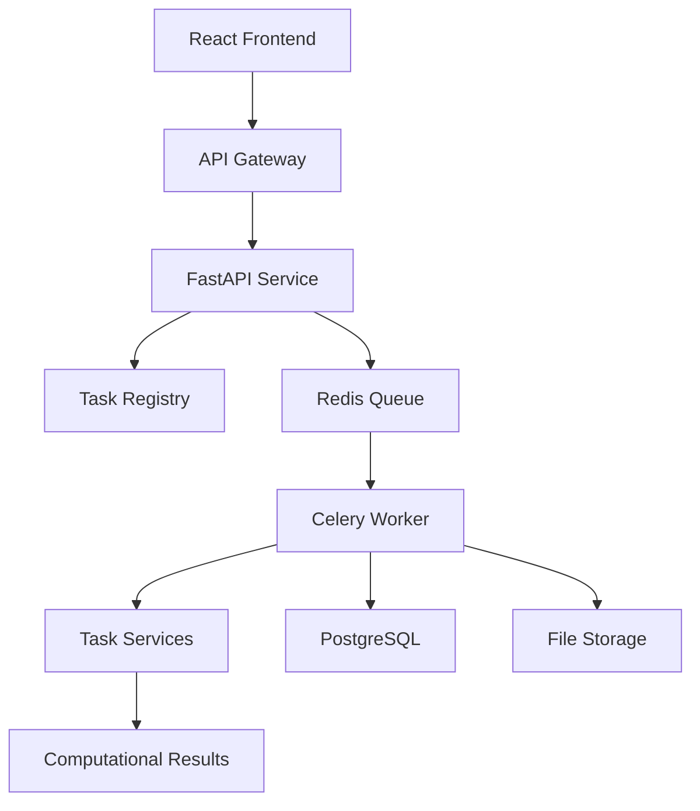

# System Architecture Overview

The Molecular Analysis Dashboard follows **Clean Architecture** (Ports & Adapters) principles with a dynamic task system enabling runtime addition of computational workflows without code deployment.

## 🏗️ **Core Architectural Principles**

### **1. Clean Architecture (Ports & Adapters)**
Strict layering with dependencies pointing inward to business logic:

```
src/molecular_analysis_dashboard/
├── domain/          # Pure business logic (Molecule, DockingJob entities)
├── use_cases/       # Application services (CreateDockingJobUseCase)
├── ports/           # Abstract interfaces (DockingEnginePort, RepositoryPort)
├── adapters/        # Implementations (PostgreSQLRepository, VinaAdapter)
├── infrastructure/  # Framework setup (Celery, FastAPI, DB sessions)
├── presentation/    # API routes and Pydantic schemas
└── shared/          # Cross-cutting utilities
```

**The Dependency Rule**: Source code dependencies can only point inwards. Nothing in an inner circle can know anything about something in an outer circle.

### **2. Dynamic Task System**
Tasks are defined in the database with OpenAPI specifications, enabling:
- **Runtime Task Addition**: New computational workflows without code deployment
- **Service Discovery**: Running task services are registered and discovered dynamically
- **Microservice Execution**: Each task type runs as independent containerized service
- **Frontend Adaptation**: React frontend automatically generates forms based on task OpenAPI specs

### **3. Multi-Tenant Architecture**
- **Organization-based isolation** for data and access
- **Shared infrastructure** with tenant-specific databases
- **JWT-based authentication** with org context
- **Resource Management**: Task execution resources managed per organization

### **4. Microservices-Ready Design**
- **Service boundaries** aligned with business domains
- **API Gateway** for routing and security
- **Async processing** for long-running operations
- **Technology flexibility** for task services (any language/framework)

## 🏭 **System Components**

### **Core Business Layer**
- **Domain Entities**: `Molecule`, `DockingJob`, `Pipeline`, `TaskDefinition`
- **Use Cases**: Application orchestration (`CreateDockingJobUseCase`, `ExecuteDynamicTaskUseCase`)
- **Domain Services**: Business rule enforcement and validation

### **Interface Layer**
- **Ports**: Abstract interfaces (`TaskRegistryPort`, `DockingEnginePort`, `ServiceDiscoveryPort`)
- **Contracts**: Stable APIs between layers

### **Implementation Layer**
- **Database Adapters**: PostgreSQL repositories with async SQLAlchemy
- **External Service Adapters**: Dynamic task service communication via HTTP
- **Messaging Adapters**: Celery task implementations and orchestration
- **Storage Adapters**: File handling (local filesystem or S3/MinIO)

### **Infrastructure Layer**
- **Configuration**: Pydantic settings and dependency injection
- **Security**: JWT authentication and authorization
- **Database**: Connection management and migrations (Alembic)
- **Task Management**: Service discovery and orchestration

### **Presentation Layer**
- **API Routes**: FastAPI routers for REST endpoints and dynamic task execution
- **Schemas**: Request/response validation with Pydantic
- **WebSocket**: Real-time task status updates

### **Frontend Application**
- **React Components**: Dynamic task interface generation
- **State Management**: React Query for server state
- **Visualization**: 3D molecular rendering (3Dmol.js)
- **Type Safety**: TypeScript with OpenAPI-generated types

## 🔄 **Service Architecture**

The system operates with three distinct service types:

### **API Services (FastAPI)**
- Handle user requests and orchestration
- Stateless and horizontally scalable
- JWT authentication and request validation
- Task orchestration and status management

### **Worker Services (Celery)**
- Background processing and workflow coordination
- Task queue management with Redis
- Long-running computational task coordination
- Result processing and storage

### **Task Services (Containerized)**
- Execute specific computational tasks (docking, analysis)
- Independent scaling based on demand
- Technology-agnostic (any language/framework)
- Standard OpenAPI interface for integration

## 📊 **Data Flow Architecture**



### **Request Flow**
1. **Client Request**: React frontend submits task through API gateway
2. **Validation**: FastAPI validates request and checks authorization
3. **Task Discovery**: System discovers available task services
4. **Queue Submission**: Task queued for background execution
5. **Worker Processing**: Celery worker coordinates task execution
6. **Service Execution**: Containerized task service performs computation
7. **Result Storage**: Results stored in database and file storage
8. **Status Updates**: Real-time status via WebSocket to frontend

## 🔐 **Security Architecture**

### **Authentication & Authorization**
- **JWT Tokens**: Organization-scoped authentication
- **Role-Based Access**: Per-organization permission model
- **API Gateway**: Centralized security enforcement
- **Rate Limiting**: Multi-tier protection (endpoint/user/org)

### **Data Protection**
- **Multi-Tenant Isolation**: Org-based data segregation
- **Secure Communication**: TLS for all service communication
- **File Security**: Signed URLs for secure file access
- **Audit Logging**: Comprehensive security event tracking

## 📈 **Scalability Patterns**

### **Horizontal Scaling**
- **Stateless Services**: API and worker services scale independently
- **Task Service Scaling**: Auto-scaling based on queue depth
- **Database Scaling**: Connection pooling and read replicas
- **Storage Scaling**: Object storage for large molecular files

### **Performance Optimization**
- **Async Processing**: Non-blocking I/O throughout the stack
- **Connection Pooling**: Efficient database resource utilization
- **Caching Strategy**: Redis for frequently accessed data
- **CDN Integration**: Static asset optimization

## 🛠️ **Technology Stack**

### **Backend Core**
- **FastAPI**: Modern Python web framework with async support
- **SQLAlchemy**: ORM with async database operations
- **Celery**: Distributed task processing
- **PostgreSQL**: Primary database with multi-tenant support
- **Redis**: Message broker and caching

### **Frontend Stack**
- **React 18**: UI framework with TypeScript
- **Material-UI**: Component library and design system
- **React Query**: Server state management
- **Vite**: Build tool and development server
- **3Dmol.js**: 3D molecular visualization

### **Infrastructure**
- **Docker**: Containerization for all services
- **OpenResty**: API Gateway (Nginx + Lua scripting)
- **Alembic**: Database migration management
- **MinIO/S3**: Object storage for molecular files

## 🎯 **Design Benefits**

### **Maintainability**
- **Clear Separation**: Each layer has single responsibility
- **Testability**: Pure business logic isolated from frameworks
- **Modularity**: Components can be developed and deployed independently

### **Flexibility**
- **Technology Agnostic**: Task services in any language/framework
- **Dynamic Extension**: Add new computational capabilities at runtime
- **Adapter Pattern**: Easy integration with external systems

### **Scalability**
- **Independent Scaling**: Services scale based on specific needs
- **Resource Efficiency**: Computational resources allocated per task type
- **Load Distribution**: Gateway-based routing and load balancing

For detailed implementation guides, see:
- [Clean Architecture Details](clean-architecture.md)
- [Domain Model](domain-model.md)
- [Service Layer Design](service-layer.md)
