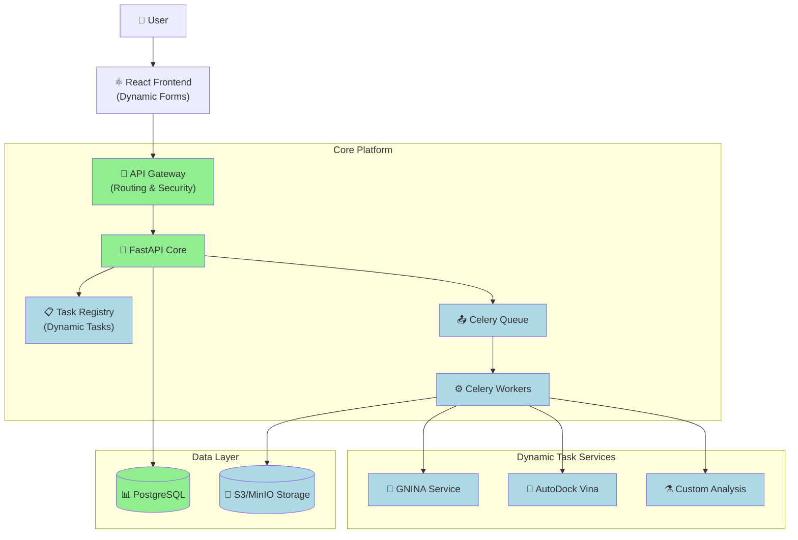
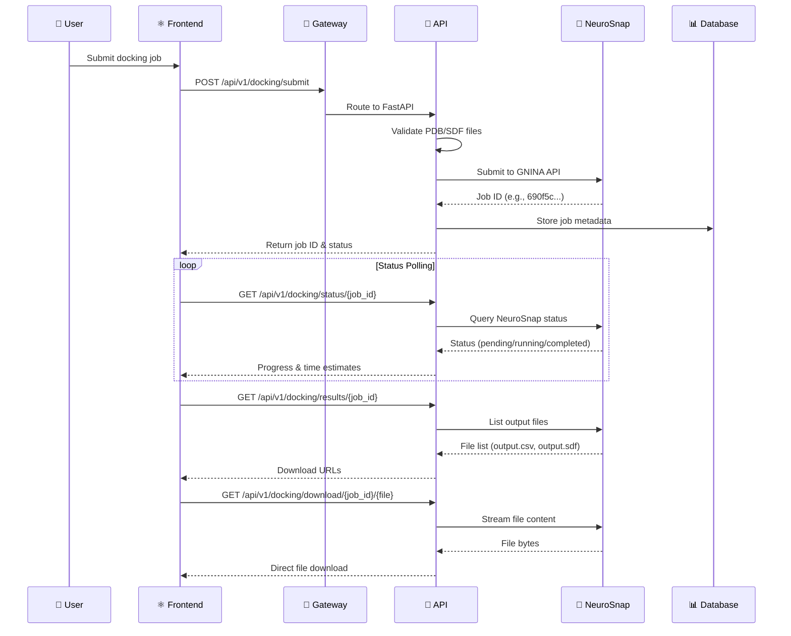
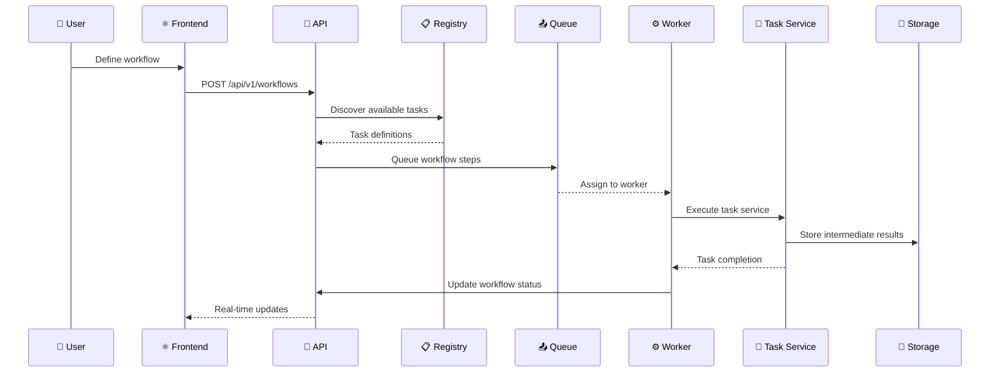

# System Architecture Overview

The Molecular Analysis Dashboard follows **Clean Architecture** (Ports & Adapters) principles with a planned dynamic task system enabling runtime addition of computational workflows without code deployment.

> **🎯 Documentation Structure**
> This document describes the **target architecture vision**. For the current implementation details, see [Current State Architecture](current-state.md).

## 📊 **Current vs. Target State Overview**

| Aspect | Current Implementation | Target Architecture |
|--------|----------------------|-------------------|
| **Status** | ✅ **Operational** | 🔄 **Planned** |
| **Architecture** | Monolithic + NeuroSnap API | Microservices + Dynamic Tasks |
| **Task System** | Static GNINA docking only | Dynamic runtime task registration |
| **Deployment** | Docker Compose | Kubernetes |
| **Scaling** | Single service instances | Independent service scaling |
| **Documentation** | [Current State](current-state.md) | This document |

---

## ✅ **Current Implementation (As-Built)**

### **What's Actually Running (November 2025)**

The system currently implements a **working molecular docking platform** with real NeuroSnap integration:

```mermaid
flowchart TD
    User["👤 User"] --> Frontend["⚛️ React Frontend\n(http://localhost:5173)"]
    Frontend --> Gateway["🚪 API Gateway\n(OpenResty/Nginx)"]
    Gateway --> API["🐍 FastAPI Backend\n(http://localhost:8000)"]
    API --> DB[("📊 PostgreSQL\nDatabase")]
    API --> Redis[("⚡ Redis\nCache & Queue")]
    API --> NeuroSnap["🧬 NeuroSnap API\n(GNINA Docking)"]]

    subgraph "Current Services"
        Gateway
        API
        DB
        Redis
    end

    subgraph "External Services"
        NeuroSnap
    end

    classDef implemented fill:#90EE90
    classDef external fill:#FFB6C1

    class User,Frontend,Gateway,API,DB,Redis implemented
    class NeuroSnap external
```

### **Currently Operational Features**
- ✅ **Complete Molecular Docking Workflow**: Submit → Monitor → Results → Download
- ✅ **Real NeuroSnap Integration**: Live GNINA cloud docking execution
- ✅ **Interactive API**: SwaggerUI at http://localhost:8000/docs
- ✅ **Multi-file Support**: PDB receptors + SDF ligands
- ✅ **Real-time Status**: Job progress tracking
- ✅ **File Download**: CSV scores + SDF coordinates
- ✅ **Clean Architecture**: Ports & Adapters implementation
- ✅ **Docker Infrastructure**: Containerized development environment

> **📋 For detailed current state documentation, see [Current State Architecture](current-state.md)**

---

## 🚀 **Target Architecture (Future Vision)**

### **Future Vision: Dynamic Task System**

This target architecture will expand beyond static docking to support **dynamic task registration** and **multi-provider workflows**:


```mermaid
flowchart TD
    User["👤 User"] --> Frontend["⚛️ React Frontend\n(Dynamic Forms)"]
    Frontend --> Gateway["🚪 API Gateway\n(Routing & Security)"]
    Gateway --> API["🐍 FastAPI Core"]
    API --> Registry["📋 Task Registry\n(Dynamic Tasks)"]
    API --> Queue["📤 Celery Queue"]
    Queue --> Worker["⚙️ Celery Workers"]
    Worker --> TaskSvc1["🧬 GNINA Service"]
    Worker --> TaskSvc2["🔬 AutoDock Vina"]
    Worker --> TaskSvc3["⚗️ Custom Analysis"]
    API --> DB[("📊 PostgreSQL")]
    Worker --> Storage[("💾 S3/MinIO Storage")]

    subgraph "Core Platform"
        Gateway
        API
        Registry
        Queue
        Worker
    end

    subgraph "Dynamic Task Services"
        TaskSvc1
        TaskSvc2
        TaskSvc3
    end

    subgraph "Data Layer"
        DB
        Storage
    end

    classDef future fill:#ADD8E6
    classDef current fill:#90EE90

    class Gateway,API,DB current
    class Registry,Queue,Worker,TaskSvc1,TaskSvc2,TaskSvc3,Storage future
```

### **Planned Capabilities (Future)**
- 🔄 **Dynamic Task Registration**: Add new computational workflows at runtime
- 🔄 **Multi-Provider Support**: Local engines + cloud services
- 🔄 **Workflow Orchestration**: Complex multi-step analysis pipelines
- 🔄 **Service Discovery**: Auto-discovery of computational services
- 🔄 **Horizontal Scaling**: Independent scaling of task services

---

## 🏗️ **Core Architectural Principles**

### **1. Clean Architecture (Ports & Adapters)**
Strict layering with dependencies pointing inward to business logic:

```
src/molecular_analysis_dashboard/
├── domain/          # Pure business logic (Molecule, DockingJob entities)
├── use_cases/       # Application services (CreateDockingJobUseCase)
├── ports/           # Abstract interfaces (DockingEnginePort, RepositoryPort)
├── adapters/        # Implementations (PostgreSQLRepository, VinaAdapter)
├── infrastructure/  # Framework setup (Celery, FastAPI, DB sessions)
├── presentation/    # API routes and Pydantic schemas
└── shared/          # Cross-cutting utilities
```

**The Dependency Rule**: Source code dependencies can only point inwards. Nothing in an inner circle can know anything about something in an outer circle.

### **2. Dynamic Task System**
Tasks are defined in the database with OpenAPI specifications, enabling:
- **Runtime Task Addition**: New computational workflows without code deployment
- **Service Discovery**: Running task services are registered and discovered dynamically
- **Microservice Execution**: Each task type runs as independent containerized service
- **Frontend Adaptation**: React frontend automatically generates forms based on task OpenAPI specs

### **3. Multi-Tenant Architecture**
- **Organization-based isolation** for data and access
- **Shared infrastructure** with tenant-specific databases
- **JWT-based authentication** with org context
- **Resource Management**: Task execution resources managed per organization

### **4. Microservices-Ready Design**
- **Service boundaries** aligned with business domains
- **API Gateway** for routing and security
- **Async processing** for long-running operations
- **Technology flexibility** for task services (any language/framework)

## 🏭 **System Components**

### **Core Business Layer**
- **Domain Entities**: `Molecule`, `DockingJob`, `Pipeline`, `TaskDefinition`
- **Use Cases**: Application orchestration (`CreateDockingJobUseCase`, `ExecuteDynamicTaskUseCase`)
- **Domain Services**: Business rule enforcement and validation

### **Interface Layer**
- **Ports**: Abstract interfaces (`TaskRegistryPort`, `DockingEnginePort`, `ServiceDiscoveryPort`)
- **Contracts**: Stable APIs between layers

### **Implementation Layer**
- **Database Adapters**: PostgreSQL repositories with async SQLAlchemy
- **External Service Adapters**: Dynamic task service communication via HTTP
- **Messaging Adapters**: Celery task implementations and orchestration
- **Storage Adapters**: File handling (local filesystem or S3/MinIO)

### **Infrastructure Layer**
- **Configuration**: Pydantic settings and dependency injection
- **Security**: JWT authentication and authorization
- **Database**: Connection management and migrations (Alembic)
- **Task Management**: Service discovery and orchestration

### **Presentation Layer**
- **API Routes**: FastAPI routers for REST endpoints and dynamic task execution
- **Schemas**: Request/response validation with Pydantic
- **WebSocket**: Real-time task status updates

### **Frontend Application**
- **React Components**: Dynamic task interface generation
- **State Management**: React Query for server state
- **Visualization**: 3D molecular rendering (3Dmol.js)
- **Type Safety**: TypeScript with OpenAPI-generated types

## 🔄 **Service Architecture**

The system operates with three distinct service types:

### **API Services (FastAPI)**
- Handle user requests and orchestration
- Stateless and horizontally scalable
- JWT authentication and request validation
- Task orchestration and status management

### **Worker Services (Celery)**
- Background processing and workflow coordination
- Task queue management with Redis
- Long-running computational task coordination
- Result processing and storage

### **Task Services (Containerized)**
- Execute specific computational tasks (docking, analysis)
- Independent scaling based on demand
- Technology-agnostic (any language/framework)
- Standard OpenAPI interface for integration

## 📊 **Data Flow Architecture**

### **Current Data Flow (As-Built)**


```mermaid
sequenceDiagram
    participant U as 👤 User
    participant F as ⚛️ Frontend
    participant G as 🚪 Gateway
    participant A as 🐍 API
    participant N as 🧬 NeuroSnap
    participant D as 📊 Database

    U->>F: Submit docking job
    F->>G: POST /api/v1/docking/submit
    G->>A: Route to FastAPI
    A->>A: Validate PDB/SDF files
    A->>N: Submit to GNINA API
    N-->>A: Job ID (e.g., 690f5c...)
    A->>D: Store job metadata
    A-->>F: Return job ID & status

    loop Status Polling
        F->>A: GET /api/v1/docking/status/{job_id}
        A->>N: Query NeuroSnap status
        N-->>A: Status (pending/running/completed)
        A-->>F: Progress & time estimates
    end

    F->>A: GET /api/v1/docking/results/{job_id}
    A->>N: List output files
    N-->>A: File list (output.csv, output.sdf)
    A-->>F: Download URLs

    F->>A: GET /api/v1/docking/download/{job_id}/{file}
    A->>N: Stream file content
    N-->>A: File bytes
    A-->>F: Direct file download
```

### **Current Request Flow (Working)**
1. **Client Request**: React frontend submits docking job through gateway
2. **File Validation**: FastAPI validates PDB/SDF format and size
3. **NeuroSnap Submission**: Direct API call to NeuroSnap GNINA service
4. **Job Tracking**: Job ID returned for status monitoring
5. **Status Polling**: Frontend polls for progress updates
6. **Results Retrieval**: List available output files when complete
7. **File Download**: Direct streaming of result files to user

### **Future Data Flow (To-Be)**


```mermaid
sequenceDiagram
    participant U as 👤 User
    participant F as ⚛️ Frontend
    participant A as 🐍 API
    participant R as 📋 Registry
    participant Q as 📤 Queue
    participant W as ⚙️ Worker
    participant T as 🧬 Task Service
    participant S as 💾 Storage

    U->>F: Define workflow
    F->>A: POST /api/v1/workflows
    A->>R: Discover available tasks
    R-->>A: Task definitions
    A->>Q: Queue workflow steps
    Q-->>W: Assign to worker
    W->>T: Execute task service
    T->>S: Store intermediate results
    T-->>W: Task completion
    W->>A: Update workflow status
    A-->>F: Real-time updates
```

## 🔐 **Security Architecture**

### **Authentication & Authorization**
- **JWT Tokens**: Organization-scoped authentication
- **Role-Based Access**: Per-organization permission model
- **API Gateway**: Centralized security enforcement
- **Rate Limiting**: Multi-tier protection (endpoint/user/org)

### **Data Protection**
- **Multi-Tenant Isolation**: Org-based data segregation
- **Secure Communication**: TLS for all service communication
- **File Security**: Signed URLs for secure file access
- **Audit Logging**: Comprehensive security event tracking

## 📈 **Scalability Patterns**

### **Horizontal Scaling**
- **Stateless Services**: API and worker services scale independently
- **Task Service Scaling**: Auto-scaling based on queue depth
- **Database Scaling**: Connection pooling and read replicas
- **Storage Scaling**: Object storage for large molecular files

### **Performance Optimization**
- **Async Processing**: Non-blocking I/O throughout the stack
- **Connection Pooling**: Efficient database resource utilization
- **Caching Strategy**: Redis for frequently accessed data
- **CDN Integration**: Static asset optimization

## 🛠️ **Technology Stack**

### **Backend Core**
- **FastAPI**: Modern Python web framework with async support
- **SQLAlchemy**: ORM with async database operations
- **Celery**: Distributed task processing
- **PostgreSQL**: Primary database with multi-tenant support
- **Redis**: Message broker and caching

### **Frontend Stack**
- **React 18**: UI framework with TypeScript
- **Material-UI**: Component library and design system
- **React Query**: Server state management
- **Vite**: Build tool and development server
- **3Dmol.js**: 3D molecular visualization

### **Infrastructure**
- **Docker**: Containerization for all services
- **OpenResty**: API Gateway (Nginx + Lua scripting)
- **Alembic**: Database migration management
- **MinIO/S3**: Object storage for molecular files

## 🎯 **Design Benefits**

### **Maintainability**
- **Clear Separation**: Each layer has single responsibility
- **Testability**: Pure business logic isolated from frameworks
- **Modularity**: Components can be developed and deployed independently

### **Flexibility**
- **Technology Agnostic**: Task services in any language/framework
- **Dynamic Extension**: Add new computational capabilities at runtime
- **Adapter Pattern**: Easy integration with external systems

### **Scalability**
- **Independent Scaling**: Services scale based on specific needs
- **Resource Efficiency**: Computational resources allocated per task type
- **Load Distribution**: Gateway-based routing and load balancing

For detailed implementation guides, see:
- [Clean Architecture Details](clean-architecture.md)
- [Domain Model](domain-model.md)
- [Service Layer Design](service-layer.md)
