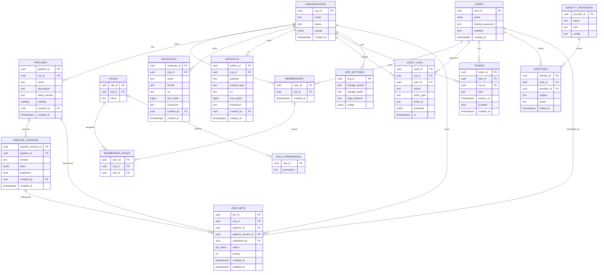
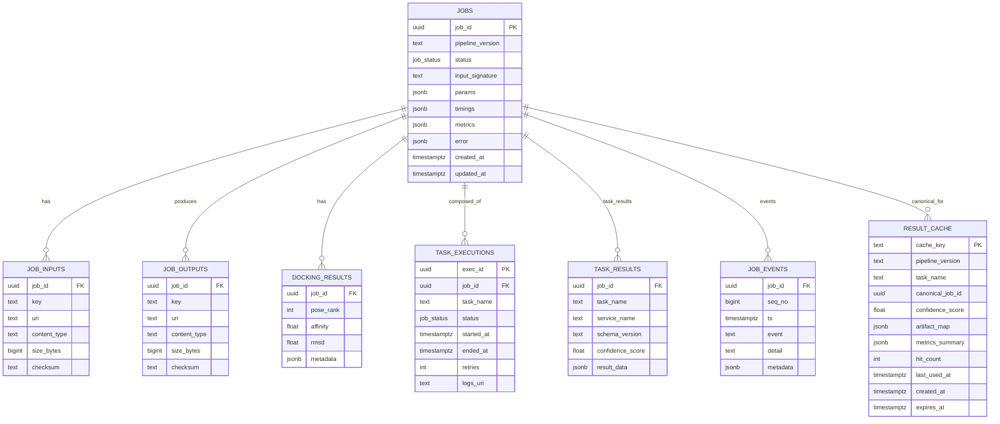
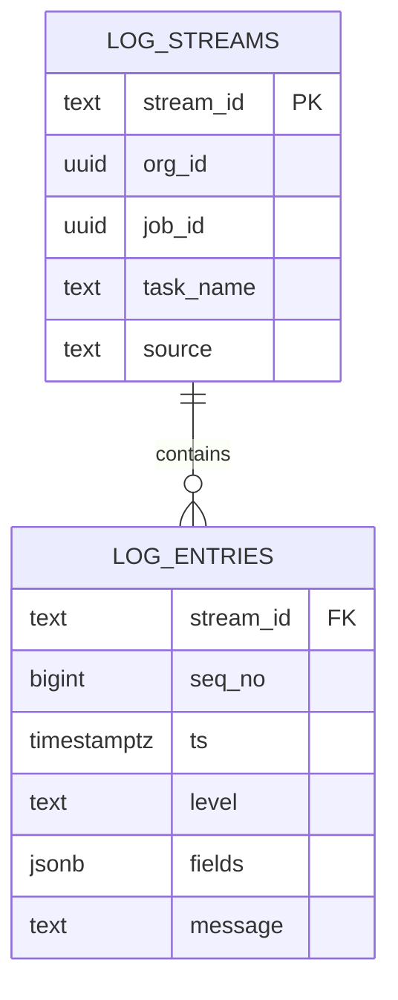

# Data Model ERD (Indicative)

A high-level entity relationship description for both the shared Metadata DB and per-org Results DBs.

Metadata DB (shared)
- organizations (org_id PK) 1—* user_org_memberships (*, org_id FK)
- users (user_id PK) 1—* user_org_memberships (*, user_id FK)
- roles (role_id PK, org_id FK) — many-to-many via role assignments (simplified as permissions[] here)
- pipelines (pipeline_id PK, org_id FK) 1—* pipeline_versions (pipeline_version_id PK)
- jobs_meta (job_id PK, org_id FK, pipeline_id FK, pipeline_version_id FK)
- audits (...)

Results DB (per org)
- jobs (job_id PK, pipeline_version_id, status, timings)
- job_inputs (job_id FK, key, uri, content_type)
- job_outputs (job_id FK, key, uri, content_type)
- docking_results (job_id FK, pose_rank, score, metadata)
- logs (job_id FK, ts, message)

Notes
- `org_id` present in all metadata tables to enforce tenant scoping.
- Artifacts referenced by URI; storage backend provides pre-signed access where applicable.
- Consider DB-level RLS in addition to repository filtering if supported.

See `DATABASES.md` for tenancy strategy and `USERS_AND_ROLES.md` for RBAC.

---

## ER Diagrams (Mermaid)

### Metadata DB (Shared)

### Results DB (Per Organization)

### Logs DB (Separate)

While `TASK_EXECUTIONS.logs_uri` points to logs in object storage or a log backend, high-volume log lines should be stored in a separate logging database.

Recommendation: Use a dedicated log store (e.g., Loki, OpenSearch) and keep only `logs_uri` pointers in relational DBs.

---

## Storage Modality Guidance

- Relational (Postgres)
  - Metadata DB: organizations, users, roles, role_permissions, memberships, membership_roles, pipelines, pipeline_versions, molecules, artifacts, audit_logs, tokens, identities, identity_providers, org_settings, jobs_meta
  - Results DB (per org): jobs (with input_signature, params, timings, metrics), job_inputs, job_outputs, docking_results, task_executions, task_results, result_cache
- Non-relational / external
  - Object storage: all file bodies (inputs/outputs/log archives), large result matrices; referenced via `uri`
  - Logs database: log lines (LOG_ENTRIES) retained outside Postgres; keep pointers only in Postgres
  - Search index (optional): for rich text/facet search over pipelines/molecules/tags when needed

---

## Potential Entities to Add (Optional/Future)

These are common additions that can enhance functionality; adopt incrementally as needed.

- Pipeline modeling (Metadata DB)
	- `TASKS`, `TASK_EDGES`: Normalize pipeline DAG inside a version for cross-version analytics and validation beyond the JSON `spec`.
	- `ADAPTERS`/`EXECUTION_PROFILES`: Catalog of execution backends and resource presets.
- Tagging & discovery (Metadata DB)
	- `TAGS`, `PIPELINE_TAGS`, `MOLECULE_TAGS`: Faceted search and organization of pipelines/molecules.
- Org configuration (Metadata DB)
	- `ORG_SETTINGS` or `ORG_INTEGRATIONS`: Per-org configuration like storage bucket/prefix, webhook endpoints, SSO provider configs.
- Identity & invitations (Metadata DB)
	- `INVITATIONS` (email, org, role, token, expiry), `PASSWORD_RESETS`, `IDENTITIES` (SSO subject mapping), `IDENTITY_PROVIDERS`.
- Notifications & webhooks (Metadata DB)
	- `WEBHOOKS` (subscriptions), `WEBHOOK_DELIVERIES` (attempts, status), `NOTIFICATIONS` (in-app).
- Service accounts & automation (Metadata DB)
	- `SERVICE_ACCOUNTS` (non-human principals) and role assignments.
- Results DB augmentations (per org)
	- `JOBS.params` (added above) to persist engine parameters.
	- `JOB_EVENTS` (timeline) for a compact status history.
	- `STRUCTURE_PROPERTIES` or `MOLECULE_PROPERTIES` (computed descriptors) if you compute/query them frequently.
