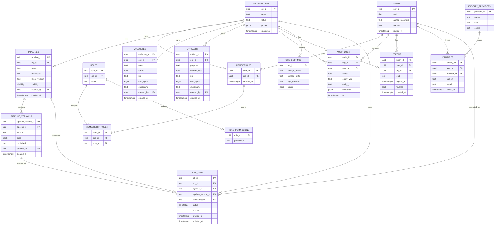

# Database Schema Design

This document describes the comprehensive database schema for the Molecular Analysis Dashboard, implementing a multi-tenant architecture with clean separation between shared metadata and organization-specific results.

## 🏗️ **Multi-Tenant Architecture**

The system uses a **hybrid multi-tenant approach** with two database types:

### **Metadata Database (Shared)**
- **Purpose**: Cross-organizational data and system configuration
- **Content**: Organizations, users, task definitions, pipeline templates
- **Access**: Shared across all tenants with org-scoped queries

### **Results Databases (Per-Organization)**
- **Purpose**: Organization-specific execution data and results
- **Content**: Jobs, executions, docking results, private data
- **Isolation**: Complete data separation per organization

```
┌─────────────────────────┐
│    Metadata Database        │
│  (Shared across all orgs)   │
│                             │
│ • organizations             │
│ • users                    │
│ • task_definitions         │
│ • pipeline_templates       │
│ • audit_logs              │
└─────────────────────────┘
               │
               │ Dynamic DB Creation
               │
    ┌────────────────────────┐
    │   Results Database      │
    │ (Per Organization)     │
    │                        │
    │ • jobs                 │
    │ • task_executions      │
    │ • docking_results       │
    │ • job_events           │
    └────────────────────────┘
```

## 📋 **Metadata Database Schema**

### **Core Entity Relationships**



### **Core Tables (22 Total)**

#### **Organization Management**
| Table | Purpose | Key Columns |
|-------|---------|-------------|
| `organizations` | Multi-tenant root entities | `org_id`, `name`, `status`, `quotas` |
| `users` | User accounts across orgs | `user_id`, `email`, `username`, `auth_data` |
| `memberships` | User-organization relationships | `user_id`, `org_id`, `role`, `permissions` |
| `roles` | Permission-based access control | `role_id`, `name`, `permissions`, `org_id` |
| `role_permissions` | Fine-grained permissions | `role_id`, `permission` |
| `membership_roles` | User role assignments | `user_id`, `org_id`, `role_id` |

#### **Workflow Management**
| Table | Purpose | Key Columns |
|-------|---------|-------------|
| `task_definitions` | Reusable analysis tasks | `task_id`, `name`, `task_type`, `config` |
| `pipeline_templates` | Workflow templates | `template_id`, `name`, `steps`, `org_id` |
| `pipelines` | Organization pipelines | `pipeline_id`, `org_id`, `name`, `description` |
| `pipeline_versions` | Versioned pipeline specs | `version_id`, `pipeline_id`, `version`, `spec` |

#### **Molecular Data**
| Table | Purpose | Key Columns |
|-------|---------|-------------|
| `molecules` | Molecular structure metadata | `molecule_id`, `name`, `formula`, `org_id` |
| `artifacts` | File and object storage refs | `artifact_id`, `org_id`, `uri`, `content_type` |

#### **System Management**
| Table | Purpose | Key Columns |
|-------|---------|-------------|
| `audit_logs` | All system activities | `log_id`, `action`, `user_id`, `timestamp` |
| `task_services` | External service integrations | `service_id`, `name`, `config`, `status` |
| `tokens` | JWT and API tokens | `token_id`, `user_id`, `org_id`, `expires_at` |
| `identities` | SSO identity mapping | `identity_id`, `user_id`, `provider_id` |
| `identity_providers` | External auth providers | `provider_id`, `name`, `kind`, `config` |
| `org_settings` | Per-org configuration | `org_id`, `storage_bucket`, `config` |
| `jobs_meta` | Cross-org job metadata | `job_id`, `org_id`, `pipeline_id`, `status` |

## 📋 **Results Database Schema (Per-Organization)**

### **Results Entity Relationships**


### **Results Tables (8 Per Organization)**

#### **Job Execution**
| Table | Purpose | Key Columns |
|-------|---------|-------------|
| `jobs` | Job execution records | `job_id`, `status`, `pipeline_version`, `params` |
| `task_executions` | Individual task runs | `execution_id`, `job_id`, `task_name`, `status` |
| `job_events` | Job lifecycle tracking | `job_id`, `event`, `timestamp`, `details` |

#### **Data Management**
| Table | Purpose | Key Columns |
|-------|---------|-------------|
| `job_inputs` | Input file references | `job_id`, `key`, `uri`, `content_type` |
| `job_outputs` | Output file references | `job_id`, `key`, `uri`, `content_type` |
| `task_results` | Task execution outputs | `result_id`, `execution_id`, `data`, `confidence` |

#### **Molecular Analysis**
| Table | Purpose | Key Columns |
|-------|---------|-------------|
| `docking_results` | Molecular docking outputs | `result_id`, `molecule_id`, `score`, `poses` |
| `result_cache` | Cached computation results | `cache_key`, `job_id`, `artifact_map` |

## 🔄 **Database Routing Strategy**

### **Connection Management**
```python
# Multi-database connection routing
class DatabaseRouter:
    def __init__(self):
        self.metadata_engine = create_async_engine(METADATA_DB_URL)
        self.results_engines = {}  # Lazy-loaded per org

    async def get_metadata_session(self) -> AsyncSession:
        """Get session for shared metadata database."""
        return AsyncSession(self.metadata_engine)

    async def get_results_session(self, org_id: UUID) -> AsyncSession:
        """Get session for organization-specific results database."""
        if org_id not in self.results_engines:
            db_url = RESULTS_DB_TEMPLATE.format(org_id=org_id)
            self.results_engines[org_id] = create_async_engine(db_url)

        return AsyncSession(self.results_engines[org_id])
```

### **Query Patterns**
```python
# Example: Cross-database operations
async def create_docking_job(
    org_id: UUID,
    pipeline_id: UUID,
    params: dict
) -> Job:
    # 1. Create job metadata in shared DB
    async with db_router.get_metadata_session() as metadata_session:
        job_meta = JobMeta(
            org_id=org_id,
            pipeline_id=pipeline_id,
            status=JobStatus.PENDING
        )
        metadata_session.add(job_meta)
        await metadata_session.commit()

    # 2. Create job execution record in org-specific DB
    async with db_router.get_results_session(org_id) as results_session:
        job = Job(
            job_id=job_meta.job_id,
            pipeline_version=params['version'],
            params=params,
            status=JobStatus.PENDING
        )
        results_session.add(job)
        await results_session.commit()

    return job
```

## 🚀 **Performance Optimization**

### **Indexing Strategy**
```sql
-- Metadata database indexes
CREATE INDEX CONCURRENTLY idx_jobs_meta_org_status
    ON jobs_meta (org_id, status);
CREATE INDEX CONCURRENTLY idx_audit_logs_org_timestamp
    ON audit_logs (org_id, ts DESC);
CREATE INDEX CONCURRENTLY idx_molecules_org_name
    ON molecules (org_id, name);

-- Results database indexes (per org)
CREATE INDEX CONCURRENTLY idx_jobs_status_created
    ON jobs (status, created_at DESC);
CREATE INDEX CONCURRENTLY idx_job_events_job_timestamp
    ON job_events (job_id, ts DESC);
CREATE INDEX CONCURRENTLY idx_docking_results_job_score
    ON docking_results (job_id, affinity DESC);
```

### **JSONB Optimization**
```sql
-- Efficient JSONB queries
CREATE INDEX CONCURRENTLY idx_jobs_params_gin
    ON jobs USING GIN (params);
CREATE INDEX CONCURRENTLY idx_pipeline_spec_gin
    ON pipeline_versions USING GIN (spec);

-- Specific JSONB field indexes
CREATE INDEX CONCURRENTLY idx_jobs_pipeline_version
    ON jobs ((params->>'pipeline_version'));
```

### **Partitioning Strategy**
```sql
-- Time-based partitioning for high-volume tables
CREATE TABLE job_events (
    job_id UUID NOT NULL,
    ts TIMESTAMPTZ NOT NULL,
    event TEXT NOT NULL,
    -- ... other columns
) PARTITION BY RANGE (ts);

-- Monthly partitions for job events
CREATE TABLE job_events_2025_01
    PARTITION OF job_events
    FOR VALUES FROM ('2025-01-01') TO ('2025-02-01');
```

## 🔐 **Security & Compliance**

### **Row-Level Security**
```sql
-- Enforce organization-level access control
ALTER TABLE jobs_meta ENABLE ROW LEVEL SECURITY;

CREATE POLICY jobs_meta_org_isolation ON jobs_meta
    FOR ALL TO application_role
    USING (org_id = current_setting('app.current_org_id')::UUID);
```

### **Data Classification**
```sql
-- Sensitive data identification
COMMENT ON COLUMN users.email IS 'PII: Email address';
COMMENT ON COLUMN docking_results.metadata IS 'Confidential: Proprietary analysis';
COMMENT ON TABLE molecules IS 'Confidential: Intellectual property';
```

### **Backup Strategy**
```bash
# Metadata database backup (full)
pg_dump -h $DB_HOST -U $DB_USER -d mad_metadata \
    --format=custom --compress=9 \
    --file="backup_metadata_$(date +%Y%m%d).dump"

# Results database backup (per org)
for org_id in $(psql -tA -c "SELECT org_id FROM organizations"); do
    pg_dump -h $DB_HOST -U $DB_USER -d "mad_results_${org_id}" \
        --format=custom --compress=9 \
        --file="backup_results_${org_id}_$(date +%Y%m%d).dump"
done
```

## 📋 **Data Types & Constraints**

### **Custom Types**
```sql
-- Enumerated types for consistency
CREATE TYPE job_status AS ENUM (
    'pending', 'queued', 'running',
    'completed', 'failed', 'cancelled'
);

CREATE TYPE visibility AS ENUM (
    'private', 'organization', 'public'
);

CREATE TYPE task_type AS ENUM (
    'docking', 'analysis', 'preprocessing',
    'postprocessing', 'validation'
);
```

### **Validation Constraints**
```sql
-- Data integrity constraints
ALTER TABLE organizations
    ADD CONSTRAINT org_name_length
    CHECK (char_length(name) BETWEEN 3 AND 100);

ALTER TABLE molecules
    ADD CONSTRAINT molecule_size_positive
    CHECK (size_bytes > 0);

ALTER TABLE docking_results
    ADD CONSTRAINT affinity_reasonable
    CHECK (affinity BETWEEN -50.0 AND 50.0);
```

### **JSONB Schemas**
```sql
-- JSONB validation for pipeline specifications
ALTER TABLE pipeline_versions
    ADD CONSTRAINT valid_pipeline_spec
    CHECK (jsonb_typeof(spec) = 'object'
           AND spec ? 'version'
           AND spec ? 'tasks');

-- Job parameters validation
ALTER TABLE jobs
    ADD CONSTRAINT valid_job_params
    CHECK (jsonb_typeof(params) = 'object');
```

## 🔄 **Migration Management**

### **Version Control**
```python
# Alembic configuration for multi-database migrations
# alembic/env.py
def run_migrations():
    """Run migrations for appropriate database."""
    branch = context.get_x_argument(as_dictionary=True).get('branch', 'metadata')

    if branch == 'metadata':
        # Run metadata database migrations
        run_metadata_migrations()
    elif branch == 'results':
        # Run results database migrations for specific org
        org_id = context.get_x_argument(as_dictionary=True).get('org_id')
        run_results_migrations(org_id)
```

### **Schema Evolution**
```sql
-- Example migration: Add new task type
ALTER TYPE task_type ADD VALUE 'optimization';

-- Add new column with default
ALTER TABLE jobs ADD COLUMN priority INTEGER DEFAULT 5;

-- Add index concurrently (no blocking)
CREATE INDEX CONCURRENTLY idx_jobs_priority ON jobs (priority DESC);
```

For detailed migration procedures, see:
- [Database Management](../management/migrations.md)
- [Multi-Tenant Operations](../connection-routing/multi-tenant-routing.md)
- [Performance Tuning](../design/performance.md)
