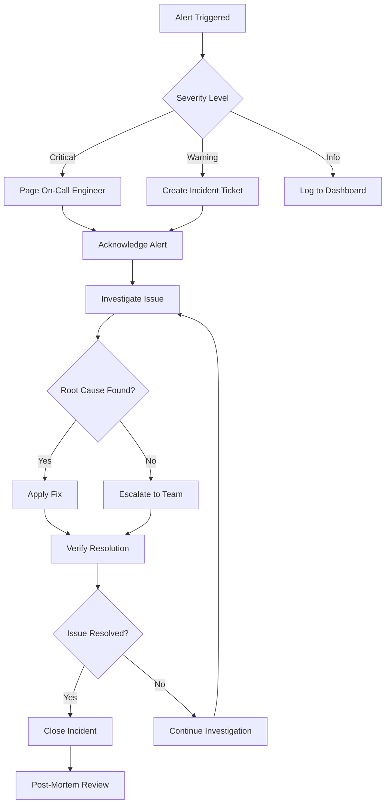

# Operations Documentation

*Comprehensive operational procedures and automation for the molecular analysis platform.*

## Overview

This section provides complete operational guides, monitoring strategies, and automation procedures for maintaining and operating the molecular analysis dashboard in production environments.

## Operations Components

### **[Monitoring](monitoring.md)**
Comprehensive monitoring and observability implementation
- Application performance monitoring (APM) setup
- Infrastructure monitoring and alerting strategies
- Custom metrics for molecular analysis workflows
- Dashboard configuration and key performance indicators
- Incident detection and automated response procedures

### **[Logging](logging.md)**
Centralized logging strategies and log analysis
- Structured logging implementation across all services
- Log aggregation and centralized analysis setup
- Security event logging and audit trails
- Performance debugging through log correlation
- Log retention policies and storage management

### **[Backup and Recovery](backup-recovery.md)**
Data protection and disaster recovery procedures
- Automated backup strategies for multi-tenant databases
- Point-in-time recovery procedures and testing
- Cross-region backup replication and verification
- Disaster recovery runbooks and recovery time objectives
- Data integrity validation and recovery procedures

### **[Maintenance](maintenance.md)**
Routine maintenance procedures and automation
- Database maintenance and optimization procedures
- Container image updates and security patching
- Storage cleanup and data archival strategies
- Performance tuning and capacity planning
- Scheduled maintenance windows and communication

## Operational Architecture

### Monitoring Stack
```
┌─────────────────────────────────────────────────────────────┐
│                    Observability Stack                      │
├─────────────────────────────────────────────────────────────┤
│  Metrics Collection     │    Logging           │  Tracing    │
│                        │                      │             │
│  • Prometheus          │  • Fluentd          │  • Jaeger   │
│  • Grafana Dashboards  │  • Elasticsearch     │  • OpenTel  │
│  • Alert Manager       │  • Kibana Analysis   │  • APM      │
│  • Custom Metrics      │  • Log Rotation      │  • Profiling│
└─────────────────────────────────────────────────────────────┘
```

### Incident Response Workflow


### Production Monitoring Configuration
```python
# monitoring/prometheus.py - Prometheus metrics collection
from prometheus_client import Counter, Histogram, Gauge, generate_latest
from fastapi import Response
import time
import psutil
import asyncio

class MetricsCollector:
    """Collect and expose application metrics"""

    def __init__(self):
        # HTTP request metrics
        self.request_count = Counter(
            'http_requests_total',
            'Total HTTP requests',
            ['method', 'endpoint', 'status']
        )

        self.request_duration = Histogram(
            'http_request_duration_seconds',
            'HTTP request duration in seconds',
            ['method', 'endpoint']
        )

        # Application metrics
        self.active_users = Gauge(
            'active_users_total',
            'Number of active users'
        )

        self.docking_jobs_total = Counter(
            'docking_jobs_total',
            'Total docking jobs processed',
            ['status', 'engine']
        )

        self.docking_job_duration = Histogram(
            'docking_job_duration_seconds',
            'Docking job duration in seconds',
            ['engine', 'organization']
        )

        # Infrastructure metrics
        self.database_connections = Gauge(
            'database_connections_active',
            'Active database connections'
        )

        self.celery_workers = Gauge(
            'celery_workers_active',
            'Active Celery workers'
        )

        self.system_cpu_usage = Gauge(
            'system_cpu_usage_percent',
            'System CPU usage percentage'
        )

        self.system_memory_usage = Gauge(
            'system_memory_usage_percent',
            'System memory usage percentage'
        )

    def record_request(self, method: str, endpoint: str, status: int, duration: float):
        """Record HTTP request metrics"""
        self.request_count.labels(
            method=method,
            endpoint=endpoint,
            status=status
        ).inc()

        self.request_duration.labels(
            method=method,
            endpoint=endpoint
        ).observe(duration)

    def record_docking_job(self, engine: str, organization: str, status: str, duration: float):
        """Record docking job metrics"""
        self.docking_jobs_total.labels(
            status=status,
            engine=engine
        ).inc()

        if duration > 0:
            self.docking_job_duration.labels(
                engine=engine,
                organization=organization
            ).observe(duration)

    async def update_system_metrics(self):
        """Update system-level metrics"""
        # CPU usage
        cpu_percent = psutil.cpu_percent(interval=1)
        self.system_cpu_usage.set(cpu_percent)

        # Memory usage
        memory = psutil.virtual_memory()
        self.system_memory_usage.set(memory.percent)

        # Database connections (would query actual database)
        # db_connections = await get_active_db_connections()
        # self.database_connections.set(db_connections)

        # Active Celery workers (would query Celery)
        # worker_count = await get_active_worker_count()
        # self.celery_workers.set(worker_count)

    async def get_metrics(self) -> str:
        """Get Prometheus-formatted metrics"""
        await self.update_system_metrics()
        return generate_latest()

# Middleware for automatic request tracking
from fastapi import Request
import time

class MetricsMiddleware:
    """FastAPI middleware for automatic metrics collection"""

    def __init__(self, app, metrics_collector: MetricsCollector):
        self.app = app
        self.metrics = metrics_collector

    async def __call__(self, scope, receive, send):
        if scope["type"] != "http":
            await self.app(scope, receive, send)
            return

        request = Request(scope, receive)
        start_time = time.time()

        # Create wrapper to capture response status
        status_code = 500

        async def send_wrapper(message):
            nonlocal status_code
            if message["type"] == "http.response.start":
                status_code = message["status"]
            await send(message)

        try:
            await self.app(scope, receive, send_wrapper)
        finally:
            # Record metrics
            duration = time.time() - start_time
            self.metrics.record_request(
                method=request.method,
                endpoint=request.url.path,
                status=status_code,
                duration=duration
            )
```

### Alerting Rules Configuration
```yaml
# monitoring/alerting-rules.yml - Prometheus alerting rules
groups:
  - name: molecular_analysis_alerts
    rules:
      # High-level service alerts
      - alert: APIServiceDown
        expr: up{job="molecular-analysis-api"} == 0
        for: 1m
        labels:
          severity: critical
        annotations:
          summary: "Molecular Analysis API is down"
          description: "The API service has been down for more than 1 minute"

      - alert: DatabaseConnectionHigh
        expr: database_connections_active > 80
        for: 5m
        labels:
          severity: warning
        annotations:
          summary: "High database connection usage"
          description: "Database connections are at {{ $value }} (>80% of limit)"

      - alert: HighErrorRate
        expr: rate(http_requests_total{status=~"5.."}[5m]) > 0.1
        for: 2m
        labels:
          severity: critical
        annotations:
          summary: "High API error rate"
          description: "API error rate is {{ $value | humanizePercentage }}"

      # Performance alerts
      - alert: SlowAPIResponse
        expr: histogram_quantile(0.95, rate(http_request_duration_seconds_bucket[5m])) > 2.0
        for: 5m
        labels:
          severity: warning
        annotations:
          summary: "Slow API responses"
          description: "95th percentile response time is {{ $value }}s"

      - alert: DockingJobFailureRateHigh
        expr: rate(docking_jobs_total{status="failed"}[10m]) / rate(docking_jobs_total[10m]) > 0.1
        for: 5m
        labels:
          severity: warning
        annotations:
          summary: "High docking job failure rate"
          description: "Docking job failure rate is {{ $value | humanizePercentage }}"

      # Resource alerts
      - alert: HighCPUUsage
        expr: system_cpu_usage_percent > 80
        for: 10m
        labels:
          severity: warning
        annotations:
          summary: "High CPU usage"
          description: "CPU usage is {{ $value }}% for more than 10 minutes"

      - alert: HighMemoryUsage
        expr: system_memory_usage_percent > 85
        for: 5m
        labels:
          severity: critical
        annotations:
          summary: "High memory usage"
          description: "Memory usage is {{ $value }}% for more than 5 minutes"

      - alert: LowDiskSpace
        expr: (1 - node_filesystem_avail_bytes / node_filesystem_size_bytes) * 100 > 85
        for: 5m
        labels:
          severity: warning
        annotations:
          summary: "Low disk space"
          description: "Disk usage is {{ $value }}% on {{ $labels.device }}"

      # Business logic alerts
      - alert: QueueBacklogHigh
        expr: celery_queue_length > 100
        for: 10m
        labels:
          severity: warning
        annotations:
          summary: "High queue backlog"
          description: "Celery queue has {{ $value }} pending jobs"

      - alert: NoJobsProcessedRecently
        expr: increase(docking_jobs_total[1h]) == 0
        for: 30m
        labels:
          severity: warning
        annotations:
          summary: "No jobs processed recently"
          description: "No docking jobs have been processed in the last hour"

  - name: infrastructure_alerts
    rules:
      - alert: ContainerRestartHigh
        expr: increase(kube_pod_container_status_restarts_total[1h]) > 5
        for: 5m
        labels:
          severity: warning
        annotations:
          summary: "Container restarting frequently"
          description: "Container {{ $labels.container }} has restarted {{ $value }} times in the last hour"

      - alert: PersistentVolumeUsageHigh
        expr: kubelet_volume_stats_used_bytes / kubelet_volume_stats_capacity_bytes * 100 > 85
        for: 5m
        labels:
          severity: warning
        annotations:
          summary: "Persistent volume usage high"
          description: "PV {{ $labels.persistentvolumeclaim }} usage is {{ $value }}%"
```

### Logging Configuration
```python
# logging/config.py - Structured logging configuration
import logging
import json
import sys
from datetime import datetime
from typing import Any, Dict, Optional

class StructuredFormatter(logging.Formatter):
    """JSON formatter for structured logging"""

    def __init__(self, service_name: str, version: str):
        self.service_name = service_name
        self.version = version
        super().__init__()

    def format(self, record: logging.LogRecord) -> str:
        log_entry = {
            "timestamp": datetime.utcnow().isoformat(),
            "service": self.service_name,
            "version": self.version,
            "level": record.levelname,
            "logger": record.name,
            "message": record.getMessage(),
            "module": record.module,
            "function": record.funcName,
            "line": record.lineno
        }

        # Add exception info if present
        if record.exc_info:
            log_entry["exception"] = self.formatException(record.exc_info)

        # Add extra fields
        if hasattr(record, 'user_id'):
            log_entry["user_id"] = record.user_id

        if hasattr(record, 'organization_id'):
            log_entry["organization_id"] = record.organization_id

        if hasattr(record, 'request_id'):
            log_entry["request_id"] = record.request_id

        if hasattr(record, 'correlation_id'):
            log_entry["correlation_id"] = record.correlation_id

        # Add performance metrics
        if hasattr(record, 'duration'):
            log_entry["duration_ms"] = record.duration

        if hasattr(record, 'job_id'):
            log_entry["job_id"] = record.job_id

        if hasattr(record, 'engine'):
            log_entry["engine"] = record.engine

        return json.dumps(log_entry)

def setup_logging(
    service_name: str,
    version: str,
    log_level: str = "INFO",
    enable_console: bool = True,
    enable_file: bool = False,
    log_file: Optional[str] = None
):
    """Setup structured logging for the application"""

    # Create formatter
    formatter = StructuredFormatter(service_name, version)

    # Configure root logger
    root_logger = logging.getLogger()
    root_logger.setLevel(getattr(logging, log_level.upper()))

    # Clear existing handlers
    root_logger.handlers.clear()

    # Console handler
    if enable_console:
        console_handler = logging.StreamHandler(sys.stdout)
        console_handler.setFormatter(formatter)
        root_logger.addHandler(console_handler)

    # File handler
    if enable_file and log_file:
        file_handler = logging.FileHandler(log_file)
        file_handler.setFormatter(formatter)
        root_logger.addHandler(file_handler)

    # Configure specific loggers

    # Reduce noise from third-party libraries
    logging.getLogger("sqlalchemy.engine").setLevel(logging.WARNING)
    logging.getLogger("urllib3.connectionpool").setLevel(logging.WARNING)
    logging.getLogger("docker").setLevel(logging.WARNING)

    # Application loggers
    logging.getLogger("molecular_analysis_dashboard").setLevel(log_level.upper())

# Context manager for request tracking
import contextvars
from uuid import uuid4

request_id_var: contextvars.ContextVar[str] = contextvars.ContextVar('request_id')
user_id_var: contextvars.ContextVar[str] = contextvars.ContextVar('user_id')
organization_id_var: contextvars.ContextVar[str] = contextvars.ContextVar('organization_id')

class LogContext:
    """Context manager for adding request context to logs"""

    def __init__(self, request_id: Optional[str] = None, user_id: Optional[str] = None,
                 organization_id: Optional[str] = None):
        self.request_id = request_id or str(uuid4())
        self.user_id = user_id
        self.organization_id = organization_id

    def __enter__(self):
        request_id_var.set(self.request_id)
        if self.user_id:
            user_id_var.set(self.user_id)
        if self.organization_id:
            organization_id_var.set(self.organization_id)
        return self

    def __exit__(self, exc_type, exc_val, exc_tb):
        # Context variables are automatically cleared
        pass

class ContextualLoggerAdapter(logging.LoggerAdapter):
    """Logger adapter that automatically adds context"""

    def process(self, msg, kwargs):
        extra = kwargs.get('extra', {})

        try:
            extra['request_id'] = request_id_var.get()
        except LookupError:
            pass

        try:
            extra['user_id'] = user_id_var.get()
        except LookupError:
            pass

        try:
            extra['organization_id'] = organization_id_var.get()
        except LookupError:
            pass

        kwargs['extra'] = extra
        return msg, kwargs

def get_logger(name: str) -> ContextualLoggerAdapter:
    """Get a contextual logger for the given name"""
    logger = logging.getLogger(name)
    return ContextualLoggerAdapter(logger, {})

# Usage example in FastAPI middleware
from fastapi import Request
import time

class LoggingMiddleware:
    """FastAPI middleware for request logging"""

    def __init__(self, app):
        self.app = app
        self.logger = get_logger(__name__)

    async def __call__(self, scope, receive, send):
        if scope["type"] != "http":
            await self.app(scope, receive, send)
            return

        request = Request(scope, receive)
        start_time = time.time()

        # Extract user context from JWT token (implementation depends on auth system)
        user_id = None
        organization_id = None
        # user_id, organization_id = extract_user_context(request)

        with LogContext(user_id=user_id, organization_id=organization_id) as ctx:
            self.logger.info(
                "Request started",
                extra={
                    'method': request.method,
                    'url': str(request.url),
                    'user_agent': request.headers.get('user-agent')
                }
            )

            status_code = 500

            async def send_wrapper(message):
                nonlocal status_code
                if message["type"] == "http.response.start":
                    status_code = message["status"]
                await send(message)

            try:
                await self.app(scope, receive, send_wrapper)
            except Exception as e:
                self.logger.error(
                    "Request failed with exception",
                    extra={
                        'method': request.method,
                        'url': str(request.url),
                        'exception_type': type(e).__name__,
                        'exception_message': str(e)
                    },
                    exc_info=True
                )
                raise
            finally:
                duration = (time.time() - start_time) * 1000  # Convert to milliseconds

                self.logger.info(
                    "Request completed",
                    extra={
                        'method': request.method,
                        'url': str(request.url),
                        'status_code': status_code,
                        'duration': duration
                    }
                )
```

### Backup and Recovery Automation
```python
# ops/backup_manager.py - Automated backup management
import asyncio
import subprocess
import boto3
from datetime import datetime, timedelta
from pathlib import Path
import logging
from typing import List, Optional

logger = logging.getLogger(__name__)

class BackupManager:
    """Automated backup and recovery management"""

    def __init__(self, config: dict):
        self.config = config
        self.s3_client = boto3.client('s3')
        self.backup_bucket = config['backup_bucket']
        self.retention_days = config.get('retention_days', 30)

    async def create_database_backup(self, organization_id: Optional[str] = None) -> str:
        """Create database backup for organization or all data"""

        timestamp = datetime.utcnow().strftime('%Y%m%d_%H%M%S')

        if organization_id:
            backup_name = f"org_{organization_id}_{timestamp}.sql"
            # Create organization-specific backup
            await self._backup_organization_data(organization_id, backup_name)
        else:
            backup_name = f"full_backup_{timestamp}.sql"
            # Create full database backup
            await self._backup_full_database(backup_name)

        # Upload to S3
        s3_key = f"database_backups/{backup_name}"
        await self._upload_to_s3(backup_name, s3_key)

        # Clean up local file
        Path(backup_name).unlink(missing_ok=True)

        logger.info(f"Backup created and uploaded: {s3_key}")
        return s3_key

    async def _backup_organization_data(self, organization_id: str, backup_name: str):
        """Create backup for specific organization"""

        # Backup organization-specific tables
        tables = ['molecules', 'docking_jobs', 'job_results', 'pipelines']

        with open(backup_name, 'w') as f:
            for table in tables:
                cmd = [
                    'pg_dump',
                    '--data-only',
                    '--table', table,
                    '--where', f"organization_id = '{organization_id}'",
                    self.config['database_url']
                ]

                result = await asyncio.create_subprocess_exec(
                    *cmd,
                    stdout=f,
                    stderr=asyncio.subprocess.PIPE
                )

                stdout, stderr = await result.communicate()

                if result.returncode != 0:
                    raise RuntimeError(f"Backup failed: {stderr.decode()}")

    async def _backup_full_database(self, backup_name: str):
        """Create full database backup"""

        cmd = [
            'pg_dump',
            '--no-owner',
            '--no-privileges',
            '--clean',
            '--if-exists',
            '--file', backup_name,
            self.config['database_url']
        ]

        result = await asyncio.create_subprocess_exec(
            *cmd,
            stdout=asyncio.subprocess.PIPE,
            stderr=asyncio.subprocess.PIPE
        )

        stdout, stderr = await result.communicate()

        if result.returncode != 0:
            raise RuntimeError(f"Backup failed: {stderr.decode()}")

    async def _upload_to_s3(self, local_file: str, s3_key: str):
        """Upload backup to S3"""

        try:
            self.s3_client.upload_file(
                local_file,
                self.backup_bucket,
                s3_key,
                ExtraArgs={
                    'ServerSideEncryption': 'AES256',
                    'StorageClass': 'STANDARD_IA'  # Cheaper storage for backups
                }
            )
        except Exception as e:
            raise RuntimeError(f"S3 upload failed: {str(e)}")

    async def restore_database(self, backup_key: str, target_database: str):
        """Restore database from backup"""

        # Download backup from S3
        local_file = Path(backup_key).name

        try:
            self.s3_client.download_file(
                self.backup_bucket,
                backup_key,
                str(local_file)
            )

            # Restore database
            cmd = [
                'psql',
                '--single-transaction',
                '--file', str(local_file),
                target_database
            ]

            result = await asyncio.create_subprocess_exec(
                *cmd,
                stdout=asyncio.subprocess.PIPE,
                stderr=asyncio.subprocess.PIPE
            )

            stdout, stderr = await result.communicate()

            if result.returncode != 0:
                raise RuntimeError(f"Restore failed: {stderr.decode()}")

            logger.info(f"Database restored from {backup_key}")

        finally:
            # Clean up downloaded file
            local_file.unlink(missing_ok=True)

    async def cleanup_old_backups(self):
        """Remove backups older than retention period"""

        cutoff_date = datetime.utcnow() - timedelta(days=self.retention_days)

        response = self.s3_client.list_objects_v2(
            Bucket=self.backup_bucket,
            Prefix='database_backups/'
        )

        objects_to_delete = []

        for obj in response.get('Contents', []):
            if obj['LastModified'].replace(tzinfo=None) < cutoff_date:
                objects_to_delete.append({'Key': obj['Key']})

        if objects_to_delete:
            self.s3_client.delete_objects(
                Bucket=self.backup_bucket,
                Delete={'Objects': objects_to_delete}
            )

            logger.info(f"Cleaned up {len(objects_to_delete)} old backups")

    async def verify_backup_integrity(self, backup_key: str) -> bool:
        """Verify backup can be restored successfully"""

        # Create temporary database for testing
        test_db_name = f"backup_test_{datetime.utcnow().strftime('%Y%m%d_%H%M%S')}"

        try:
            # Create test database
            await self._create_test_database(test_db_name)

            # Restore backup to test database
            await self.restore_database(backup_key, test_db_name)

            # Verify data integrity
            integrity_ok = await self._verify_data_integrity(test_db_name)

            return integrity_ok

        except Exception as e:
            logger.error(f"Backup verification failed: {str(e)}")
            return False

        finally:
            # Clean up test database
            await self._drop_test_database(test_db_name)

    async def _create_test_database(self, db_name: str):
        """Create temporary database for testing"""

        cmd = ['createdb', db_name]
        result = await asyncio.create_subprocess_exec(*cmd)
        await result.wait()

    async def _drop_test_database(self, db_name: str):
        """Drop temporary test database"""

        cmd = ['dropdb', db_name]
        result = await asyncio.create_subprocess_exec(*cmd)
        await result.wait()

    async def _verify_data_integrity(self, db_name: str) -> bool:
        """Verify restored data integrity"""

        # Run basic integrity checks
        checks = [
            "SELECT COUNT(*) FROM organizations",
            "SELECT COUNT(*) FROM molecules",
            "SELECT COUNT(*) FROM docking_jobs"
        ]

        for check in checks:
            cmd = ['psql', '-d', db_name, '-c', check]
            result = await asyncio.create_subprocess_exec(
                *cmd,
                stdout=asyncio.subprocess.PIPE,
                stderr=asyncio.subprocess.PIPE
            )

            stdout, stderr = await result.communicate()

            if result.returncode != 0:
                logger.error(f"Integrity check failed: {stderr.decode()}")
                return False

        return True

# Scheduled backup automation
import schedule
import threading

class BackupScheduler:
    """Automated backup scheduling"""

    def __init__(self, backup_manager: BackupManager):
        self.backup_manager = backup_manager
        self.scheduler_thread = None
        self.running = False

    def start(self):
        """Start backup scheduler"""

        # Schedule daily full backups at 2 AM
        schedule.every().day.at("02:00").do(
            self._run_async_job,
            self.backup_manager.create_database_backup
        )

        # Schedule hourly incremental backups (if implemented)
        # schedule.every().hour.do(self._run_incremental_backup)

        # Schedule weekly cleanup
        schedule.every().monday.at("03:00").do(
            self._run_async_job,
            self.backup_manager.cleanup_old_backups
        )

        self.running = True
        self.scheduler_thread = threading.Thread(target=self._run_scheduler)
        self.scheduler_thread.daemon = True
        self.scheduler_thread.start()

        logger.info("Backup scheduler started")

    def stop(self):
        """Stop backup scheduler"""
        self.running = False
        if self.scheduler_thread:
            self.scheduler_thread.join()
        logger.info("Backup scheduler stopped")

    def _run_scheduler(self):
        """Run the scheduler in background thread"""
        while self.running:
            schedule.run_pending()
            time.sleep(60)  # Check every minute

    def _run_async_job(self, async_func):
        """Run async function in scheduler"""
        asyncio.run(async_func())
```

## Incident Response

### Automated Incident Response
```python
# ops/incident_response.py - Automated incident response
import asyncio
import logging
from enum import Enum
from typing import Dict, List, Optional
from datetime import datetime

logger = logging.getLogger(__name__)

class Severity(Enum):
    LOW = "low"
    MEDIUM = "medium"
    HIGH = "high"
    CRITICAL = "critical"

class IncidentManager:
    """Automated incident detection and response"""

    def __init__(self, config: dict):
        self.config = config
        self.active_incidents = {}
        self.response_handlers = {}

        # Register response handlers
        self._register_handlers()

    def _register_handlers(self):
        """Register automated response handlers"""

        self.response_handlers.update({
            'high_error_rate': self._handle_high_error_rate,
            'database_connection_exhaustion': self._handle_db_connections,
            'memory_leak': self._handle_memory_leak,
            'disk_space_low': self._handle_disk_space,
            'service_down': self._handle_service_down
        })

    async def handle_alert(self, alert_name: str, severity: Severity, metadata: Dict):
        """Handle incoming alert and trigger appropriate response"""

        incident_id = f"{alert_name}_{datetime.utcnow().strftime('%Y%m%d_%H%M%S')}"

        incident = {
            'id': incident_id,
            'alert_name': alert_name,
            'severity': severity,
            'metadata': metadata,
            'created_at': datetime.utcnow(),
            'status': 'active',
            'actions_taken': []
        }

        self.active_incidents[incident_id] = incident

        logger.error(
            f"Incident {incident_id} created: {alert_name}",
            extra={
                'incident_id': incident_id,
                'severity': severity.value,
                'alert_name': alert_name
            }
        )

        # Trigger automated response
        if alert_name in self.response_handlers:
            try:
                await self.response_handlers[alert_name](incident)
            except Exception as e:
                logger.error(f"Automated response failed: {str(e)}", exc_info=True)

        # Send notifications
        await self._send_notifications(incident)

    async def _handle_high_error_rate(self, incident: Dict):
        """Handle high API error rate"""

        actions = []

        # 1. Enable circuit breaker for problematic endpoints
        await self._enable_circuit_breaker()
        actions.append("Enabled circuit breaker")

        # 2. Scale up API replicas
        await self._scale_service('api', scale_factor=1.5)
        actions.append("Scaled API service")

        # 3. Check for recent deployments
        recent_deployment = await self._check_recent_deployments()
        if recent_deployment:
            # Consider automatic rollback for critical severity
            if incident['severity'] == Severity.CRITICAL:
                await self._initiate_rollback(recent_deployment)
                actions.append("Initiated automatic rollback")

        incident['actions_taken'].extend(actions)

        logger.info(
            f"Automated response completed for {incident['id']}",
            extra={'actions': actions}
        )

    async def _handle_db_connections(self, incident: Dict):
        """Handle database connection exhaustion"""

        actions = []

        # 1. Kill long-running queries
        killed_queries = await self._kill_long_running_queries()
        if killed_queries > 0:
            actions.append(f"Killed {killed_queries} long-running queries")

        # 2. Increase connection pool size temporarily
        await self._increase_connection_pool()
        actions.append("Increased database connection pool")

        # 3. Enable connection pooling if not enabled
        await self._enable_connection_pooling()
        actions.append("Enabled connection pooling")

        incident['actions_taken'].extend(actions)

    async def _handle_memory_leak(self, incident: Dict):
        """Handle memory leak detection"""

        actions = []

        # 1. Capture memory dump for analysis
        await self._capture_memory_dump()
        actions.append("Captured memory dump")

        # 2. Restart affected services
        affected_service = incident['metadata'].get('service')
        if affected_service:
            await self._restart_service(affected_service)
            actions.append(f"Restarted {affected_service} service")

        # 3. Enable memory monitoring
        await self._enable_memory_monitoring()
        actions.append("Enabled enhanced memory monitoring")

        incident['actions_taken'].extend(actions)

    async def _handle_disk_space(self, incident: Dict):
        """Handle low disk space"""

        actions = []

        # 1. Clean up temporary files
        cleaned_space = await self._cleanup_temporary_files()
        actions.append(f"Cleaned {cleaned_space}MB temporary files")

        # 2. Archive old logs
        archived_logs = await self._archive_old_logs()
        actions.append(f"Archived {archived_logs} old log files")

        # 3. Trigger log rotation
        await self._trigger_log_rotation()
        actions.append("Triggered log rotation")

        # 4. Request additional storage if critical
        if incident['severity'] == Severity.CRITICAL:
            await self._request_storage_expansion()
            actions.append("Requested storage expansion")

        incident['actions_taken'].extend(actions)

    async def _handle_service_down(self, incident: Dict):
        """Handle service downtime"""

        actions = []

        # 1. Check service health
        service_name = incident['metadata'].get('service')
        health_status = await self._check_service_health(service_name)

        # 2. Restart service if unhealthy
        if not health_status:
            await self._restart_service(service_name)
            actions.append(f"Restarted {service_name} service")

        # 3. Check dependencies
        dependency_issues = await self._check_service_dependencies(service_name)
        if dependency_issues:
            actions.append(f"Found dependency issues: {dependency_issues}")

        # 4. Enable backup service if available
        await self._enable_backup_service(service_name)
        actions.append("Enabled backup service")

        incident['actions_taken'].extend(actions)

    async def _send_notifications(self, incident: Dict):
        """Send incident notifications"""

        # Send to Slack, PagerDuty, email, etc.
        notification_channels = self.config.get('notification_channels', [])

        for channel in notification_channels:
            try:
                await self._send_to_channel(channel, incident)
            except Exception as e:
                logger.error(f"Failed to send notification to {channel}: {str(e)}")

    # Placeholder methods for actual implementations
    async def _enable_circuit_breaker(self): pass
    async def _scale_service(self, service: str, scale_factor: float): pass
    async def _check_recent_deployments(self): return None
    async def _initiate_rollback(self, deployment): pass
    async def _kill_long_running_queries(self): return 0
    async def _increase_connection_pool(self): pass
    async def _enable_connection_pooling(self): pass
    async def _capture_memory_dump(self): pass
    async def _restart_service(self, service: str): pass
    async def _enable_memory_monitoring(self): pass
    async def _cleanup_temporary_files(self): return 0
    async def _archive_old_logs(self): return 0
    async def _trigger_log_rotation(self): pass
    async def _request_storage_expansion(self): pass
    async def _check_service_health(self, service: str): return True
    async def _check_service_dependencies(self, service: str): return []
    async def _enable_backup_service(self, service: str): pass
    async def _send_to_channel(self, channel: str, incident: Dict): pass
```

## Best Practices

### Operational Excellence
- **Proactive Monitoring**: Comprehensive monitoring and alerting before issues occur
- **Automated Response**: Automated incident response for common scenarios
- **Regular Backups**: Automated, verified backup procedures with disaster recovery testing
- **Documentation**: Comprehensive runbooks and operational procedures
- **Post-Mortems**: Regular incident analysis and system improvements

### Performance Optimization
- **Capacity Planning**: Regular capacity analysis and resource planning
- **Performance Monitoring**: Continuous performance tracking and optimization
- **Resource Utilization**: Efficient resource allocation and cost optimization
- **Scaling Strategies**: Automated horizontal and vertical scaling
- **Caching**: Comprehensive caching strategies for performance

### Security Operations
- **Security Monitoring**: Continuous security event monitoring and analysis
- **Vulnerability Management**: Regular security scanning and patch management
- **Compliance**: Automated compliance checking and reporting
- **Incident Response**: Security incident detection and response procedures
- **Access Management**: Regular access reviews and privilege management

## Related Documentation

- **[Security Policies](../security/README.md)** - Security configuration and policies
- **[Deployment Procedures](../deployment/README.md)** - Deployment and infrastructure setup
- **[Database Management](../database/management/README.md)** - Database operational procedures
- **[Development Tools](../development/tools/README.md)** - Development and debugging tools
- **[API Documentation](../api/README.md)** - API operational guidelines
