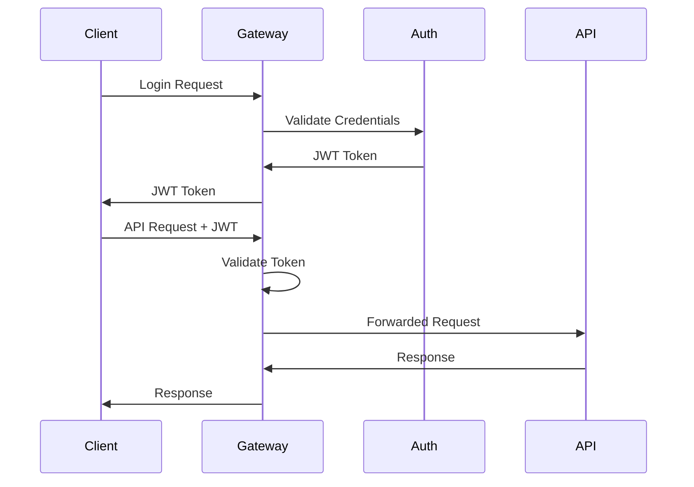

# Security Documentation

*Comprehensive security architecture, protocols, and compliance guidelines for the Molecular Analysis Dashboard.*

## Overview

The Molecular Analysis Dashboard implements defense-in-depth security principles with multi-layered protection for sensitive molecular data, user credentials, and computational resources.

## Security Architecture

### **[Security Architecture](architecture.md)**
**Complete security design and implementation patterns**
- Authentication and authorization frameworks
- Data protection and encryption strategies
- Network security and API gateway protection
- Audit logging and compliance monitoring

### **[Users & Roles](users-roles.md)**
**Role-based access control (RBAC) implementation**
- User roles and permission matrices
- Organization-based multi-tenancy
- Administrative controls and user management
- Service account patterns

## Core Security Features

### 🔐 **Authentication & Authorization**
- **JWT Tokens**: Secure, stateless authentication
- **Role-Based Access**: User, Admin, Super Admin hierarchies
- **Organization Isolation**: Multi-tenant data boundaries
- **Session Management**: Token lifecycle and refresh patterns

### 🔒 **Data Protection**
- **Encryption at Rest**: Database and file storage encryption
- **Encryption in Transit**: TLS 1.3 for all communications
- **Input Validation**: Comprehensive request sanitization
- **SQL Injection Prevention**: Parameterized queries and ORM protection

### 🛡️ **API Security**
- **Rate Limiting**: Per-user and per-endpoint throttling
- **CORS Configuration**: Secure cross-origin resource sharing
- **API Gateway Protection**: Centralized security enforcement
- **Request Validation**: Schema-based input validation

### 📊 **Audit & Monitoring**
- **Access Logging**: Complete audit trail for compliance
- **Security Events**: Real-time monitoring and alerting
- **Error Tracking**: Centralized error monitoring
- **Performance Metrics**: Security-relevant performance indicators

## Security Standards

### Authentication Flow


### Multi-Tenant Data Isolation
```sql
-- All queries must include organization context
SELECT * FROM molecules
WHERE organization_id = :current_user_org_id
  AND id = :molecule_id;

-- Row-level security enforced at database level
CREATE POLICY org_isolation ON molecules
FOR ALL TO app_role
USING (organization_id = current_setting('app.current_org_id')::uuid);
```

### Secure Configuration
```bash
# Environment variables for security configuration
JWT_SECRET_KEY=your-256-bit-secret
JWT_ALGORITHM=HS256
JWT_EXPIRATION_HOURS=24

DATABASE_SSL_MODE=require
REDIS_SSL=true

CORS_ALLOWED_ORIGINS=https://molecular-dashboard.com
API_RATE_LIMIT_PER_MINUTE=100
```

## Security Compliance

### Data Privacy
- **GDPR Compliance**: User data portability and deletion
- **Data Retention**: Configurable retention policies
- **Anonymization**: Personal data anonymization capabilities
- **Consent Management**: User consent tracking and management

### Industry Standards
- **OWASP Top 10**: Protection against common vulnerabilities
- **ISO 27001**: Information security management practices
- **HIPAA Ready**: Healthcare data protection capabilities
- **SOC 2 Type II**: Security and availability controls

## Security Operations

### Security Monitoring
```bash
# Check security logs
docker compose logs gateway | grep -E "(401|403|429)"

# Monitor authentication attempts
docker compose logs api | grep "authentication"

# Review audit logs
docker compose exec postgres psql -c "SELECT * FROM audit_log WHERE event_type = 'security';"
```

### Incident Response
1. **Detection**: Automated monitoring and alerting
2. **Assessment**: Impact analysis and threat classification
3. **Containment**: Isolate affected systems and data
4. **Remediation**: Apply fixes and security patches
5. **Recovery**: Restore normal operations
6. **Lessons Learned**: Update security procedures

### Security Updates
```bash
# Regular security maintenance
# 1. Update base container images
docker compose pull

# 2. Update Python dependencies
pip-audit --requirements requirements.txt

# 3. Update Node.js dependencies
npm audit && npm audit fix

# 4. Apply database security patches
docker compose exec postgres apt update && apt upgrade
```

## Security Testing

### Automated Security Scanning
```bash
# Python security scanning
bandit -r src/molecular_analysis_dashboard/
safety check --requirements requirements.txt

# Frontend security scanning
npm audit
cd frontend && npm run security-scan

# Container security scanning
docker scout cves molecular-dashboard:latest
trivy image molecular-dashboard:latest
```

### Penetration Testing
- **Regular assessments**: Quarterly security assessments
- **Vulnerability management**: Systematic vulnerability remediation
- **Security code reviews**: Peer review of security-critical code
- **Red team exercises**: Simulated attack scenarios

## Security Checklist

### Development Security
- [ ] All secrets stored in environment variables or secure vaults
- [ ] Input validation implemented for all endpoints
- [ ] SQL injection protection via parameterized queries
- [ ] XSS protection through output encoding
- [ ] CSRF protection for state-changing operations
- [ ] Secure session management with JWT best practices

### Infrastructure Security
- [ ] TLS 1.3 enabled for all external communications
- [ ] Database connections encrypted with SSL
- [ ] API rate limiting configured and tested
- [ ] Container images regularly updated and scanned
- [ ] Network segmentation between services
- [ ] Firewall rules restrict unnecessary access

### Operational Security
- [ ] Security monitoring and alerting configured
- [ ] Audit logging enabled for all critical operations
- [ ] Backup encryption and secure storage
- [ ] Incident response procedures documented and tested
- [ ] Security training completed by all team members
- [ ] Regular security assessments and penetration testing

## Related Documentation

- **[API Security](../api/contracts/rest-api.md)** - API-specific security measures
- **[Database Security](../database/management/performance.md)** - Database protection strategies
- **[Deployment Security](../deployment/cloud/production.md)** - Production security configuration
- **[Development Security](../development/workflows/cicd-pipeline.md)** - Secure development practices

## Emergency Contacts

- **Security Team**: security@algentics.com
- **Incident Response**: incident@algentics.com
- **Vulnerability Reports**: security-reports@algentics.com
- **Emergency Hotline**: +1-XXX-XXX-XXXX

## Security Resources

- [OWASP Security Guidelines](https://owasp.org/)
- [FastAPI Security Best Practices](https://fastapi.tiangolo.com/tutorial/security/)
- [React Security Guidelines](https://reactjs.org/docs/dom-elements.html#dangerouslysetinnerhtml)
- [PostgreSQL Security Documentation](https://www.postgresql.org/docs/current/security.html)
