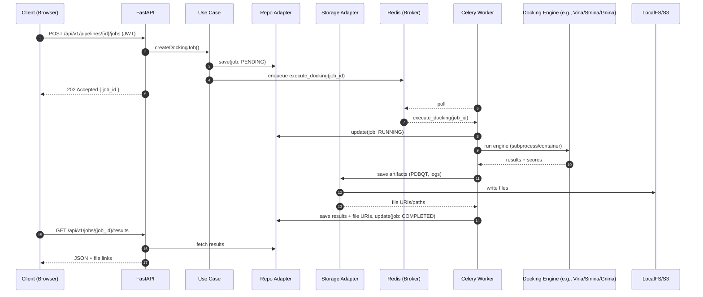
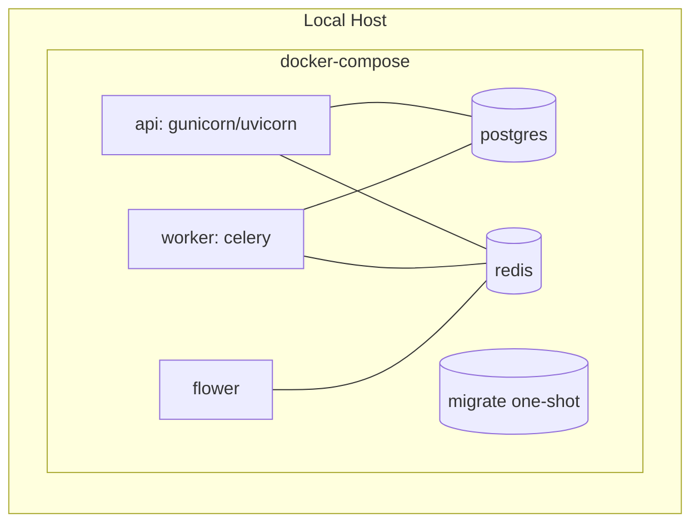
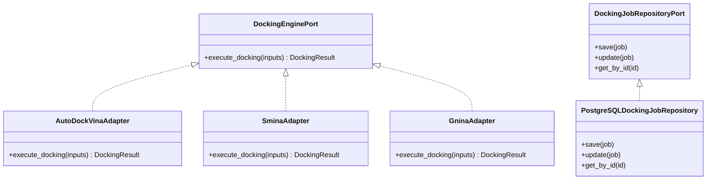

# Framework Design

This document describes how frameworks and libraries are used across the Clean Architecture layers of the Molecular Analysis Dashboard and provides visual diagrams of the solution using Mermaid.

- Scope: mapping of frameworks to layers, runtime interactions, deployment topology, and contracts between components.
- Audience: developers and operators who need to understand how the solution is built and deployed.

---

## Layer-to-Framework Mapping

- Presentation (API): FastAPI (+ Uvicorn/Gunicorn)
- Use Cases: Pure Python orchestrations (no framework dependency), **dynamic task orchestration**
- Ports: Python ABCs/Protocols (type-checked interfaces), **TaskRegistryPort, ServiceDiscoveryPort**
- Adapters:
  - Database: SQLAlchemy (async) repositories, Alembic for migrations, **task registry adapters**
  - External Engines: **Dynamic task service adapters** (HTTP-based), legacy docking engine adapters (AutoDock Vina, Smina, Gnina), RDKit for processing
  - Messaging: Celery tasks, **task service orchestration**
  - **Service Discovery**: Kubernetes service discovery, health monitoring
- Infrastructure: Settings (Pydantic), Security/JWT, Celery app wiring, DB session management, **task service management**
- External Services: PostgreSQL, Redis, **containerized task services**, optional S3/MinIO for file/object storage

---

## High-Level Component View

```mermaid
flowchart TD
  subgraph Client
    UI["React TypeScript UI<br/>Material-UI + 3Dmol.js<br/>Dynamic Task Forms"]
  end

  subgraph API
    Router["Routers / Schemas"]
    TaskAPI["Dynamic Task API"]
  end

  subgraph Core
    UC["Use Cases"]
    TaskUC["Task Management Use Cases"]
    Ports["Ports (Interfaces)"]
    TaskPorts["Task Registry & Service Ports"]
    Domain["Domain Entities"]
    TaskDomain["Task Definition Entities"]
  end

  subgraph Adapters
    RepoAdapter["PostgreSQL Repository"]
    TaskRepoAdapter["Task Registry Adapter"]
    EngineAdapter["Dynamic Task Service Adapters"]
    StorageAdapter["Storage Adapter"]
    ServiceDiscovery["Service Discovery Adapter"]
  end

  subgraph Infra
    DB["SQLAlchemy + Alembic"]
    CeleryApp["Celery App"]
    Worker["Celery Worker"]
    TaskOrchestrator["Task Service Orchestrator"]
  end

  subgraph TaskServices["Containerized Task Services"]
    DockingService["Molecular Docking Service"]
    AnalysisService["Analysis Service"]
    CustomService["Custom Task Service"]
  end
    Security["Auth/JWT"]
    Config["Settings"]
  end

  subgraph External
    Postgres[("PostgreSQL")]
    Redis[("Redis")]
    LocalFS[("Local Filesystem")]
    ObjectStore[("S3/MinIO")]
  Vina[("AutoDock Vina")]
  Smina[("Smina")]
  Gnina[("Gnina")]
  end

  UI -->|HTTP| Router
  Router --> UC
  UC --> Ports
  Ports --> RepoAdapter
  Ports --> EngineAdapter
  Ports --> StorageAdapter

  RepoAdapter --> DB
  DB --> Postgres

  EngineAdapter --> Vina
  EngineAdapter --> Smina
  EngineAdapter --> Gnina

  UC -->|enqueue| CeleryApp
  CeleryApp --> Redis
  Worker -->|consume| Redis
  Worker --> EngineAdapter
  Worker --> RepoAdapter
  Worker --> StorageAdapter

  StorageAdapter --> LocalFS
  StorageAdapter --> ObjectStore
```

Note: For development, artifacts (uploads/results) can be stored on the local filesystem. For production, switch the Storage Adapter to S3/MinIO. The adapter abstraction means the core and use cases are unchanged.
## High‑Level Component Descriptions

This section explains each entity shown in the High‑Level Component View, its responsibilities, and how it scales.

- Client › UI
  - Role: Browser-based client and 3D visualization (e.g., 3Dmol.js/NGL) that consumes the public HTTP API.
  - Responsibilities: Upload molecular files, configure pipeline parameters, trigger docking, view status and results.
  - Scaling: Horizontal via CDN and static hosting; independent of backend scaling.

- API › Router (FastAPI Presentation)
  - Role: Public HTTP surface that validates requests (Pydantic), applies auth, and forwards to use cases.
  - Responsibilities: REST endpoints, input/output schemas, request-scoped dependencies, error mapping, health/readiness.
  - Scaling: Stateless; run multiple replicas behind a load balancer. Long work is offloaded to Celery.

- Core › UC (Use Cases)
  - Role: Application orchestration layer implementing business workflows.
  - Responsibilities: Validate preconditions, interact with Ports, compose domain operations, publish tasks/events.
  - Scaling: In-process logic within API and worker nodes; scales with the hosting process.

- Core › Ports (Interfaces)
  - Role: Clean Architecture ports (Python Protocols/ABCs) that define contracts to external systems.
  - Responsibilities: RepositoryPort, DockingEnginePort, StoragePort, NotifierPort, etc.; enable adapter swapping.
  - Scaling: Not runtime components; they enforce boundaries that make horizontal scaling and tech changes easier.

- Core › Domain (Entities/Value Objects)
  - Role: Pure business model (e.g., Molecule, DockingJob, Pipeline, DockingParameters).
  - Responsibilities: Encapsulate invariants and domain rules; no external dependencies.
  - Scaling: Not a runtime node; used across API and Worker processes.

- Adapters › RepoAdapter (Database Repository)
  - Role: Concrete implementation of repository ports using SQLAlchemy/Alembic.
  - Responsibilities: Persist/retrieve jobs, molecules, pipelines; apply indices and pagination; map entities to tables.
  - Scaling: Shares DB connections through pooling; tune pool size, add read replicas/partitioning as data grows.

- Adapters › Docking Engine Adapter(s)
  - Role: Executes molecular docking using pluggable engines (e.g., AutoDock Vina, Smina, Gnina) behind a stable port.
  - Responsibilities: File preparation/conversion, subprocess execution, parsing logs/results, error translation.
  - Scaling: CPU-bound; scale Celery workers and pin concurrency; support multiple engine queues if needed.

- Adapters › StorageAdapter (File/Object Storage)
  - Role: Unified interface to persist artifacts (inputs, outputs, logs) to Local FS (dev) or S3/MinIO (prod).
  - Responsibilities: Put/Get files, generate pre-signed URLs, organize tenant/pipeline/job paths, lifecycle policies.
  - Scaling: Prefer S3/MinIO for production; local FS only for dev/single-node. Independent from DB throughput.

- Infra › DB (SQLAlchemy + Alembic)
  - Role: Database session/engine management and migrations.
  - Responsibilities: Async engine, session factories, migration scripts, connection pooling/health checks.
  - Scaling: Add PgBouncer for pooling; introduce read replicas and partitioning as needed.

- Infra › CeleryApp (Task Queue Wiring)
  - Role: Celery configuration (broker URL, queues, routes, serializers) and worker bootstrap.
  - Responsibilities: Queue naming/routing (e.g., docking, postprocess), retry/backoff, acks_late/prefetch tuning.
  - Scaling: Horizontal by adding workers; per-queue autoscaling; consider RabbitMQ for stronger delivery guarantees.

- Infra › Security (Auth/JWT)
  - Role: Authentication and authorization primitives for multi-tenant access.
  - Responsibilities: JWT issuance/verification, role/tenant checks, secrets rotation, token lifetimes.
  - Scaling: Stateless token validation in API; externalize signing keys/secrets.

- Infra › Config (Settings)
  - Role: Centralized configuration via environment variables and Pydantic settings.
  - Responsibilities: URLs, credentials, timeouts, feature flags, adapter selections (e.g., storage=“s3” vs “local”).
  - Scaling: Immutable config per deploy; mount secrets via env or secret manager.

- External › Postgres
  - Role: Relational store for metadata (users, pipelines, jobs, indexes).
  - Responsibilities: Durable, transactional record of system state and queries.
  - Scaling: Vertical first; then read replicas, connection pooling, and partitioning. Managed offerings recommended.

- External › Redis
  - Role: Message broker (and optionally cache later).
  - Responsibilities: Queue transport for Celery workers, task state, result backend (optional).
  - Scaling: Single-node for dev; Redis Cluster or RabbitMQ for scale/reliability; separate broker from cache.

- External › LocalFS
  - Role: Node-local filesystem for development and single-host testing.
  - Responsibilities: Fast ephemeral or bind-mounted storage; not shared across hosts by default.
  - Scaling: Not suitable for multi-node; replace with object storage in production.

- External › ObjectStore (S3/MinIO)
  - Role: Durable, scalable object storage for large artifacts (structures, outputs, logs).
  - Responsibilities: Versioned buckets, server-side encryption, lifecycle policies, pre-signed downloads.
  - Scaling: Horizontally scalable by design; offloads large file bandwidth from API.

- External › Docking Engines (Vina/Smina/Gnina)
  - Role: Docking engine runtimes executed by adapters/workers.
  - Responsibilities: Perform docking given prepared inputs and parameters; produce scores and poses.
  - Scaling: Provision CPU pools; sharding by queue; consider GPU/alternative engines if needed.

- Worker › Celery Worker
  - Role: Execute long-running tasks outside the request/response path.
  - Responsibilities: Run docking tasks, save artifacts via StorageAdapter, persist results via RepoAdapter, emit notifications.
  - Scaling: Scale replicas and concurrency; set `--prefetch-multiplier=1`, `acks_late=true`, and per-queue routing for fairness.
---

## Sequence: Submitting and Executing a Docking Job



---

## Deployment Topology (Docker Compose)



Notes:
- `api` is stateless; scale with `docker compose up --scale api=N`.
- `worker` scales independently; choose concurrency and prefetch for fairness.
- `migrate` runs Alembic once per schema change.

---

## Contracts (Ports) and Implementations (Adapters)



---

## Error Handling, Reliability, and Observability

- Retries: Use Celery retries or Tenacity around external calls (engines, storage)
- Idempotency: Tasks should tolerate retries (e.g., check if results already persisted)
- Health checks: `/health` (liveness) and `/ready` (DB+broker readiness)
- Logging: structured logs (JSON or structlog), include `job_id` for correlation
- Metrics/Tracing: optional Prometheus and OpenTelemetry integration in infra

---

## Configuration and Secrets

- Pydantic-based settings, reading from environment variables (see `.env.example`)
- Docker Compose wires DATABASE_URL, Redis URL, and storage directories
- For production, store secrets in a secrets manager or orchestrator (e.g., K8s Secrets)

---

## Scalability Considerations

- API: stateless, scale horizontally; keep per-request work short
- Workers: scale by queue depth and expected runtime; prefer `acks_late` + fair prefetch
- Database: add indexes for frequent queries; use connection pooling
- Storage: evolve from local volumes to S3/MinIO for large artifacts

---

## References

- Architecture overview: ARCHITECTURE.md
- Tools & workflow: TOOLS_AND_WORKFLOW.md
- Docker deployment: DEPLOYMENT_DOCKER.md
